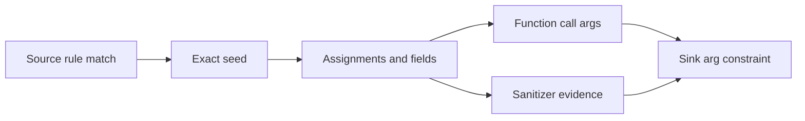

# Concepts

## Sources

A source is a rule-matched fact that introduces untrusted data: request parameters, headers, CLI input, queue messages, environment values, calldata, database rows, or other boundary values. Source rules live under `security-patterns/langs/<lang>/sources/`.

<Note>
Inferred sources are opt-in. `--inferred-sources` creates synthetic entry-point parameter sources for audit coverage, but normal security scans seed only real source rules.
</Note>

## Sinks

A sink is a dangerous operation such as command execution, SQL execution, template rendering, file access, event emission, or external calls. Sink rules live under `sinks/` and carry severity, CWE, tag, package, and tainted-argument constraints.

## Sanitizers

A sanitizer is evidence that a value was validated or encoded in a relevant context. Sanitizers do not erase taint; they annotate reachable source-to-sink paths so triage can distinguish unsanitized, sanitized, and wrong-context findings.

<Note>
A sanitizer that is correct for one sink family may be wrong for another. For example, HTML escaping does not sanitize a shell command.
</Note>

## Taint

Taint is tracked through assignments, arguments, returns, receiver methods, fields, containers, callbacks, and cross-file calls. The engine records which argument at a call site is tainted so the rendered flow explains why each hop is relevant.

## Flow Types

`FLOW`, `SOURCE FLOW`, and `TAINT FLOW` are intentionally different text labels.

| Label | Produced by | Meaning |
|---|---|---|
| `FLOW` | `inspect`, grouped inspect output, and navigation-oriented views | A resolved call path or fact path that reaches a query. It is useful for code navigation and debugging reachability. |
| `SOURCE FLOW` | `security source-analysis` | A path produced by running taint forward from a matched source rule. It maps where boundary data can travel without requiring a sink. |
| `TAINT FLOW` | `security taint-analysis` | A source-to-sink finding path where the security engine proved tainted data reaches the sink operand. Steps include tainted argument indexes or receiver evidence where available. |

<Note>
Navigation commands may use broad cached dataflow facts to stay fast and discoverable. Security finding flows use source-specific taint seeds so the rendered evidence follows the matched source value instead of every reachable local in the entry function.
</Note>

## Lifecycle FSM

Lifecycle rules model state transitions such as open then use, close then use, lock then unlock, allocate then free, or approve then transfer. The rulepack uses `requires_state` when a sink is only meaningful after a prior transition.

## Must-Alias

Must-alias constraints require the transition and use to happen on the same logical object, receiver, or handle. They reduce false paths in lifecycle-style rules where sharing only a name or type is not enough.

## Missing-Call

Missing-call rules flag paths where a required validation, authorization, cleanup, or guard call is absent before a sink. These checks are rule-side constraints over the path, not string-only grep.

<Warning>
Missing-call checks should be narrow. A broad missing-call rule can turn normal framework routing or helper indirection into false positives.
</Warning>
