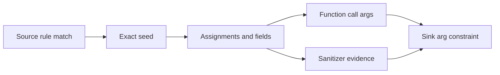

# Concepts

## Compiler Frontends And Shared IR

bonsai-ninja treats Tree-sitter as the syntax layer of a compiler pipeline.
Each of the 20 adapters owns its grammar and converts language syntax into
`Decl`, `ImportSpec`, `FlowEvent`, `Place`, type, module, receiver,
constructor, and capability facts. Shared passes operate on that typed IR.
They do not select behavior by language name, scan a cross-language token
inventory, or infer library semantics from arbitrary identifier spelling.

The resolver builds exact or narrowed call edges from module/import identity,
signatures, receiver types, inheritance, aliases, and adapter facts. The
callgraph and IDG then form the common semantic substrate for navigation,
security, debug dataflow, and export. A fact that cannot be resolved is omitted
from authoritative output and recorded as incomplete; it is not widened into a
guessed edge.

Semantic prewarm publishes a generation of immutable per-file compiler
objects. An object contains the adapter's typed declarations, imports, flow
facts, and parser/adapter diagnostics—not a Tree-sitter pointer or source-text
guess. Reuse requires the same relative path, selected adapter, frontend ABI,
and SHA-256 source digest. This lets every later phase consume one syntax
interpretation while a changed file alone falls back to Tree-sitter lowering.
The completed generation is replaced atomically; queries never observe half
old and half new compiler state.

Workspace-wide resolution retains compact declaration, type, module,
inheritance, import, and stable-symbol headers. Security, inspect, export, and
IDG construction stream exact bodies from the compiler-object generation and
remap them to those symbols. This separates body lifetime from graph lifetime
without introducing another parser or lowering path.

## Sources

A source is a rule-matched fact that introduces untrusted data: request parameters, headers, CLI input, queue messages, environment values, database rows, or other boundary values. Source rules live under `security-patterns/langs/<lang>/sources/`.

<Note>
Inferred sources are opt-in. `--inferred-sources` creates synthetic entry-point parameter sources for audit coverage, but normal security scans seed only real source rules.
</Note>

## Sinks

A sink is a dangerous operation such as command execution, SQL execution, template rendering, file access, event emission, or external calls. Sink rules live under `sinks/` and carry severity, CWE, tag, package, and tainted-argument constraints.

## Sanitizers

A sanitizer is evidence that a value was validated or encoded in a relevant context. Sanitizers do not erase taint; they annotate reachable source-to-sink paths so triage can distinguish unsanitized, sanitized, and wrong-context findings.

<Note>
A sanitizer that is correct for one sink family may be wrong for another. For example, HTML escaping does not sanitize a shell command.
</Note>

## Taint

Taint is tracked through assignments, arguments, returns, receiver methods, fields, containers, positional tuple/list elements, callbacks, and cross-file calls, including import/export and package-internal handler-to-service hops. Source rules stay contextual: for example, GraphQL resolver arguments are modeled as `args.<field>` / `variables.<field>` receiver reads, not as every object property in a GraphQL file. The engine records which argument at a call site is tainted so the rendered flow explains why each hop is relevant.

Production propagation is one sparse, monotone IDG closure that runs to its
reachable fixed point. It has no BFS name search, implicit call-depth bound,
iteration budget, or semantic result cap. The same closure supplies security,
source analysis, dump-taint, compatibility APIs, and native export. Structural
navigation preserves path languages as compressed compiler graphs instead of
enumerating their combinations. Requested taint-path and diagnostic renderers
may materialize individual witnesses; presentation limits never alter
reachability and always report truncation.

Large closures page fixed-width node facts and AST-derived field transforms
from temporary compiler relations. Available memory controls only how many
pages stay hot; it does not select files, names, paths, iterations, or edges.
On a smaller machine the same fixed point can perform more I/O and take
longer, but it does not silently become a smaller analysis.

Receiver-method flow is semantic: adapters emit type aliases and parent
links, the index path enriches receiver type facts, and resolver-backed
passes use those facts instead of receiver-name allowlists or class-span
guessing.

Return flow is semantic too: expression-bodied functions and true
tail-expression languages expose implicit returns as adapter facts.
Ordinary terminal statements are not guessed to be return values. Returned
object fields and tuple/list positions remain separate, so a tainted
second return element does not taint the first destructured binding.

Call-result flow uses explicit models for value-preserving operations.
String transforms, formatting helpers, joins, and Go `append` carry their
real operands forward, while structural bookkeeping such as
`sizeof(buf)` and buffer terminator writes is ignored as value-free
metadata. Closure-factory calls are resolved only when the returned
callable is unique.

## Flow Types

`FLOW`, `SOURCE FLOW`, and `TAINT FLOW` are intentionally different text labels.

| Label | Produced by | Meaning |
|---|---|---|
| `FLOW` | `inspect`, grouped inspect output, and navigation-oriented views | A stable structural evidence unit. For ordinary inspect this is one matched callable; endpoint queries use an exact compressed compiler corridor rather than enumerating every path combination. |
| `SOURCE FLOW` | `security source-analysis` | A path produced by running taint forward from a matched source rule. It maps where boundary data can travel without requiring a sink. |
| `TAINT FLOW` | `security taint-analysis` | A source-to-sink finding path where the security engine proved tainted data reaches the sink operand. Steps include tainted argument indexes or receiver evidence where available. |

<Note>
Navigation, review, export, and security commands render semantic evidence
only. When a call, import, or dynamic dispatch cannot be resolved, output is
marked incomplete with explicit reasons instead of widening the flow.
Pagination and preview budgets limit presentation only; they do not cap the
semantic fixed point.
</Note>

## Lifecycle FSM

Lifecycle rules model state transitions such as open then use, close then use, lock then unlock, allocate then free, or approve then transfer. The rulepack uses `requires_state` when a sink is only meaningful after a prior transition.

## Must-Alias

Must-alias constraints require the transition and use to happen on the same logical object, receiver, or handle. They reduce false paths in lifecycle-style rules where sharing only a name or type is not enough.

## Missing-Call

Missing-call rules flag paths where a required validation, authorization, cleanup, or guard call is absent before a sink. These checks are rule-side constraints over the path, not string-only grep.

<Warning>
Missing-call checks should be narrow. A broad missing-call rule can turn normal framework routing or helper indirection into false positives.
</Warning>
