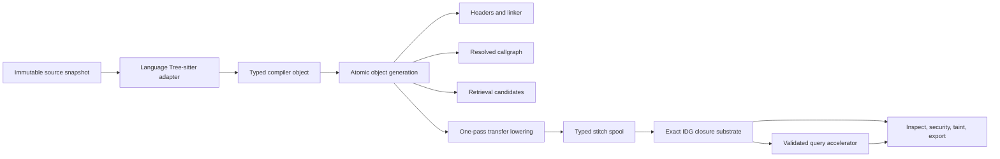

# Architecture

bonsai-ninja is a 47-crate Rust workspace. The shape is concentric — each
layer leans on the ones below and never reaches up. New contributors usually
work in one or two layers at a time, so this doc is organised the same way.

```
┌────────────────── CLI / SDK ──────────────────┐
│  bonsai_cli   bonsai_sdk   bonsai_adapters    │
└──────────────────────▲────────────────────────┘
        ┌──────────────┴──────────────┐
        │  Query / browse / trace     │
        │  bonsai_inspect  browse  trace
        │  bonsai_retrieval
        └──────────────▲──────────────┘
        ┌──────────────┴──────────────┐
        │  Security                   │
        │  bonsai_security            │
        └──────────────▲──────────────┘
        ┌──────────────┴──────────────┐
        │  Workspace facade           │
        │  bonsai_workspace           │
        └──────────────▲──────────────┘
        ┌──────────────┴──────────────┐
        │  Analysis core              │
        │  bonsai_taint               │
        │  bonsai_callgraph           │
        │  bonsai_abstract_interp     │
        │  bonsai_resolve  index  db  cfg
        └──────────────▲──────────────┘
        ┌──────────────┴──────────────┐
        │  Parse + ingest             │
        │  bonsai_parser  vfs  diagnostics
        └──────────────▲──────────────┘
        ┌──────────────┴──────────────┐
        │  Adapter framework          │
        │  bonsai_lang_api            │
        │  bonsai_lang_*  (21 languages)
        └──────────────▲──────────────┘
        ┌──────────────┴──────────────┐
        │  Foundation                 │
        │  bonsai_common  bonsai_hash │
        └─────────────────────────────┘
```

## Foundation

**`crates/common`** carries the workspace's stable IDs (`FileId`, `FuncId`,
`SymbolId`, `BasicBlockId`, `TypeId`, `ValueId`, `TraceStepId`, `PackageId`)
and metadata primitives. Every fact crossing a layer boundary carries a
`Precision` from the lattice `Exact < Narrowed < OverApproximate < Unknown`,
so consumers always know the confidence of what they're looking at. Spans
are half-open byte ranges, line/column lookups go through a thread-local
LRU cache.

`crates/common::resources` also owns resource scheduling. Memory limits are
detected from the host and the process's active nested Linux cgroup v1/v2
memory controller, optionally lowered by
`BONSAI_MEMORY_BUDGET_MB`. Weighted compiler batches use each source unit's
actual byte size after subtracting the process's measured resident set and a
safety margin. The weighted scheduler charges a fixed per-unit frontend cost
plus measured source bytes, so several small files can run concurrently under
a 3 GiB budget while one genuinely large unit runs alone. IDG transfer obtains
the same exact VFS byte length through the compiler semantics provider after
linkage/resolver state is resident. Unsupported RSS probes fall back to a
conservative reserve. This is never an analysis budget. The workspace's
exact-body cache also derives its byte budget from this effective memory
limit. That cache changes how much adapter-lowered IR is retained between
exact lookups, not which IR is produced or which files are analyzed. The
budget is not an operating-system RSS limit: clean memory-mapped factstore
pages, allocator arenas, stacks, and output buffers can make RSS exceed it.
Under pressure the OS can reclaim those clean pages while Bonsai serializes,
spills, or exactly recomputes compiler bodies. Resource accounting changes
throughput and representation only.

Raw workspace ingestion has a lighter schedule than parsing. Independent
source reads run concurrently in byte-weighted windows derived from the live
memory budget; each completed window is published to the VFS in canonical path
order. Consequently I/O concurrency cannot renumber `FileId`s, change the
snapshot, or create a second whole-workspace source copy on constrained hosts.
Matcher body scans use one continuous work-stealing pool sized against the
largest actual source units that could overlap. They do not place a barrier
after every CPU-sized group of files.

**`crates/hash`** provides FNV-1a digests for every persisted ID. Sole API:
`fnv1a_str_slice64`, `fnv1a_names64`, `fnv1a_bytes64`, `fnv1a_low32`. RFC
vector verified.

## Parse and ingest

**`crates/vfs`** is the file registry — single-writer, multi-reader,
versioned text snapshots, incremental edits. Case-insensitive filesystems
get folded to lowercase keys.

**`crates/diagnostics`** is intentionally tiny. Phases push
`Diagnostic { span, severity, message, code, notes }` into a sink; rendering
is the consumer's job.

**`crates/parser`** is a concurrent tree-sitter parse cache keyed on VFS
identity, file, language, and version. Adapters share the exact same
`Arc<Tree>` for an immutable source snapshot. Mutable parsers are checked out
from per-language pools, so same-language files parse concurrently without a
global parser lock. It walks every ERROR/MISSING node; parsing is
uncapped by default, with `BONSAI_PARSE_TIMEOUT_MS` available for explicitly
bounded diagnostic runs.

## Immutable compiler objects and generations

**`crates/db/src/compiler_object.rs`** is the syntax-to-semantic ownership
boundary. For each source snapshot it persists a relocatable
`CompiledFileObject` containing adapter-lowered declarations, imports, flow
events, syntax facts, and parser/adapter diagnostics. It never persists a raw
Tree-sitter tree or parser handle.

The object generation exposes independently integrity-checked projections for
imports, compact syntax targets, function attribution, and normalized browse
facts. Syntax targets contain adapter-lowered calls, assignment aliases,
factory assignments, and receiver/type evidence. Rule planning first tests raw
source anchors, then exact import/package headers, then exact syntax targets.
Only surviving files decompress declarations and flow events. The full body
remains the canonical source when a surviving file needs matching, transfer,
or rendered evidence; this is one compiler IR with staged decoding, not a
second parser.

Compiler diagnostics also carry per-source-snapshot coverage. A successful
file with zero diagnostics is recorded just as deliberately as a file with an
ERROR/MISSING node. A later completeness audit compiles only unchecked source
snapshots, while an edit invalidates both the marker and that file's diagnostic
rows. This prevents a broad command from repeating the same Tree-sitter and
adapter pass merely to prove that an already-lowered file was clean.

Object identity is the workspace-relative path/module context, selected
adapter, explicit frontend ABI, and SHA-256 of the complete source. A
factstore generation contains exact per-object payload digests and a strong
generation digest. Publication is atomic. A stale generation may still supply
an unchanged content-addressed object; generation refresh copies its validated
compressed payload directly and recompiles only misses.

`FileId` is a deterministic full-workspace source ordinal, not the insertion
position of a scoped query. Filtered and literal-prefiltered opens retain that
ordinal with sparse VFS slots. A one-file or candidate-only workspace can
therefore decode the exact same compiler object as a complete workspace
without reparsing or changing symbol identity.



`index --semantic` runs compiler objects, callgraph, retrieval, linkage, and
IDG as ordered worker processes. The IDG worker also compiles the default
semantic contextual fixed point and compact node/function directories into an
independently decodable query accelerator beside the canonical graph. The
accelerator is representation-only: deleting it causes exact recomputation,
not different edges or results. The process boundary returns Tree-sitter and
allocator arenas to the OS. Later workers open the same object generation, so
the boundary does not imply another syntax interpretation. The parent then
validates every sidecar against the same current workspace snapshot; if a file
changed between workers, it reruns the exact phases until one coherent atomic
generation is current. That retry reaches quiescence without an iteration cap.

The linkage factstore publishes three independently decodable views of that
generation:

- a declaration/type symbol table used by syntax lookup and exact-body symbol
  rebinding; and
- finalized receiver inheritance used to enrich file-local compiler bodies
  for receiver-sensitive inventory without loading the whole symbol table;
  and
- compact AST-derived call/return linkage used by callgraph and IDG stitching.

Both carry the same source ledger, semantic ABI, declaration count, and
canonical `FileId`/`SymbolId` order. A syntax query reads only the symbol
payload. It does not deserialize call linkage and does not decode all
per-file flow-event bodies merely to discard them. File-local inventory reads
the receiver-ancestry payload, enriches the compact syntax-target header, and
filters exact import and syntax-target facts before body decode. Import
evidence is read directly from each compiler object even when optional
workspace-package prewarm has no languages, so a static import cannot be lost
at that phase boundary. When a selected function needs global flow evidence,
its exact compiler object is streamed and rebound to the persisted symbol
table.

On a cold command, receiver ancestry is demand-driven. The file-local syntax
pass requests the workspace ancestry projection only when a typed call has the
right method target and a base class could change its match, or when an
explicit receiver-type constraint could change. Missing method names, regex
targets, and untyped receivers cannot trigger a whole-workspace declaration
pass. If ancestry is needed, the candidate plan is rerun with the exact base
map before any body is admitted; this changes phase scheduling, never rule
semantics.

Files deferred for ancestry retain their independently decoded syntax and
import headers. Once the receiver projection is available, planning enriches
and rechecks those same exact headers rather than reopening every deferred
compiler object. Non-deferred plans remain admitted and are never recomputed.

The global index is a linker header, not a second copy of every body. It keeps
declarations, aggregate layouts, types, modules, imports, inheritance, and
stable symbol identities. Exact consumers stream one compiler-object body at a
time, remap its file-local symbols to the header, and release it after the
memory-aware batch unless the byte-weighted hot cache retains it. This is the
large-workspace invariant: body and graph lifetimes do not multiply peak
memory, while every requested body is still analyzed exactly.

## Query phase contracts

Commands request the lowest compiler product that can answer their contract:

- `tree` walks the filesystem directly and never opens the compiler,
  callgraph, rulepack, or IDG.
- Syntax inventories stream file-local `CompiledFileObject` facts. Definitions
  and cross-file symbol labels may retain compact linker headers; none of these
  commands retains all function bodies.
- File/name/kind predicates run during the IR walk before result-row
  allocation. JSON pagination estimates serialized fields only and never reads
  text-only source-line previews.
- `read-file` opens a one-file scoped workspace by default. Explicit flow,
  rulepack, or cross-file-body options select workspace semantics.
- `inspect` matches compact headers, streams exact occurrence bodies per
  candidate file, and hydrates exact bodies only for selected rendered chains.
- Security and export retain compact linkage beside the sparse IDG and stream
  exact compiler bodies through the byte-weighted cache.
- Every IDG query reuses `IdgQueryService::global_linkage_index()`. Calling
  `AnalyzerDb::global_index()` from an IDG query is an architecture violation:
  it creates a second workspace-wide body representation and turns a warm
  graph query back into a full frontend pass. Attribution may re-lower one
  exact file through the compiler-object cache when rendered evidence needs
  body-level events.

A lazy workspace-wide cache must be initialized before entering a Rayon
file loop or outside that loop entirely. Constructing it from a worker can
deadlock a saturated pool and makes every worker wait for work that requires
the same pool. `syntax_inventory_commands_never_materialize_workspace_bodies`,
`inspect_taint_flow_uses_workspace_syntax_flow_query_facade`, and
`idg_taint_queries_reuse_canonical_linkage_without_global_body_materialization`
in the architecture conformance suite enforce these boundaries.

The IDG's sparse monotone queue is a compiler fixed-point solver, not a
bounded breadth-first path search. Facts are reprocessed only when the lattice
state grows, including across recursive call components, until no state
changes. There is no semantic hop, depth, iteration, file, or result ceiling.
Path previews and pages are separate rendered artifacts and report any
truncation explicitly.

## Adapter framework

**`crates/lang_api`** holds the trait every language adapter implements
plus the kit that drives ~70% of every adapter.

The `LanguageAdapter` trait is the contract: report a `LanguageId`,
declare extensions and capabilities, parse declarations and imports.
Adapters never see core internals — they get an `AdapterContext { vfs,
diagnostics, tree_provider, workspace_root }`. The optional tree provider is
the narrow bridge to the database's versioned parser cache; standalone adapter
tests can omit it.

The kit is split across several files:

- `kit/mod.rs` — `GrammarHandler`, the generic walker, decl-index pipeline,
  flow-event extraction, RHS-token scanning, branch repair entry point.
- `kit/branch_repair.rs` — span-based then/else partition recovery for
  grammars that lump both arms together.
- `kit/bindings.rs` — pattern and foreach lowering from tree-sitter fields.
- `kit/identifiers.rs` — identifier-shape predicates.
- `kit/param_extraction.rs` — parameter names + annotations.
- `kit/pseudo_call.rs` — JSX, Go channel sends, C++ delete, PHP echo,
  Ruby backticks, Scala infix concat — all lowered to `FlowEvent::Call`.
- `kit/qualified.rs` — canonicalises `obj['k']`, `obj.k`, and `obj->k`
  to the same dotted form.
- `kit/return_extraction.rs` — return / throw / catch value extraction.

The kit owns language-neutral compiler mechanics: walking a Tree-sitter tree,
constructing common IR types, stable spans, and reusable algorithms over
adapter-supplied node/field facts. Each adapter owns source syntax and
semantics: grammar node kinds, declarations, imports, scopes, receivers,
constructors, module roots, exports, type spellings, exception forms, and
async/lambda boundaries. Shared analysis must not branch on language id or
carry a union of source-language tokens.

**`crates/lang_*`** — 21 adapters, one per supported language. Adapters
range from a few hundred to a few thousand lines: they declare the
`GrammarHandler`, run `decl_index_with_handler`, post-process to fill in
language-specific facts. The internal capability matrix tracks what each
adapter handles precisely versus partially.

## Analysis core

**`crates/db`** is the compiler-object and in-memory fact database. Every
other analysis crate reads from it and writes back through it. Broad
declaration/import APIs converge on `compiler_file_object_uncached`; a narrow
uncached query can compile one missing object directly from Tree-sitter.

The persisted IDG builder lowers each function transfer exactly once. At a
file boundary it spills the canonical segment plus a compact typed stitch
record and local-to-segment node map. Stitching hydrates one segment and moves
that record into the linker; it does not reparse or re-lower the AST. Every
scheduled function and fixed-point relation is still consumed.

Before `index --semantic` publishes the immutable IDG generation, it derives
the query-ready `FuncId -> SegmentId` directory, unified numeric node
identities, and default `Exact/Narrowed` contextual CSR from that same spooled
graph. Warm open validates array lengths, ownership, CSR offsets/targets, and
call-boundary identities before installing the accelerator. A normal cold
query may persist only the canonical graph; semantic prewarm distinguishes
that valid-but-cold artifact and completes the accelerator rather than
silently treating it as warm.

Workspace IDG generations are single-flight in process and own a
target-specific advisory lock across processes. A waiter validates and reuses
the immutable sidecar published by the current owner before doing compiler
work. It removes only well-formed FactStore staging files in the same
versioned IDG family after independently proving ownership of each target; a
hard-killed process therefore cannot strand an unbounded cache artifact, and
an active peer's staging files are never swept by filename guesswork.
Saved-file edits acquire the semantic generation guards before changing VFS
text, so one build cannot observe old indexes mixed with a new source
snapshot.

Interprocedural return summaries are compiled from structural call boundaries
identified by caller, resolved callee, and exact call span. The compiler
reconstructs one function-local CSR at a time from canonical segment edges,
composes the current callee summaries, and requeues callers whenever a callee
summary grows. Recursive and mutually recursive components therefore reach
their least fixed point without a depth, iteration, or graph-size cap. The
contextual query runtime stores matched call and return boundaries in sorted
sparse source rows and streams ordinary local relations directly into CSR;
it does not retain a second workspace-sized endpoint relation.

Symbolic field flow is compiled into numeric access-path facts and algebraic
transforms emitted from the adapter-lowered AST. Query setup streams the
persisted transform relation once through bounded external sort runs, then
stores every transform field in a fixed-width, source-indexed temporary
relation. Node facts use the same fixed-width paging pattern. Broad closures
therefore read exact numeric rows without repeatedly decoding whole IDG
segments or MessagePack transform chunks. Page-cache size can change I/O and
latency, but never the transform set or closure result. Multi-parameter return
summaries may first evaluate the union of all remaining formal seeds; a
negative union is a proof that each member is negative, while positive unions
are still checked per parameter. This removes redundant work without changing
the least fixed point.

Closure reached sets use sorted external runs, while pending LIFO frontiers
store all spilled chunks in one append-only temporary file and truncate
consumed tails. Memory scheduling therefore remains exact without making file
descriptor use proportional to closure fan-out.

These external representations are lazy. Normal function-sized closures begin
with empty sparse sets and in-memory frontiers. A dense workspace bitset is
allocated only when reached-node density makes it smaller than the sparse
representation; positive/Bloom acceleration and temporary files are allocated
only on the first actual spill. This matters because return-summary
compilation creates many independent fixed points. Eagerly reserving each
fixed point's maximum spill page makes large-project latency proportional to
allocator and file setup rather than compiler facts. Unit and architecture
conformance tests pin the lazy boundary.

Large compiler phases transfer only their canonical result across a scoped
worker-heap boundary. Transient maps, sort buffers, and CSR construction state
are released before the next phase begins. This is allocation-lifetime
isolation, not parallel semantic execution or a result budget: every compiler
unit and fixed-point relation is still evaluated.

Memory-bounded export may unload the resident IDG between compiler and
presentation phases. The workspace retains only the validated pipeline hash
for the current immutable source generation, so reloading the same sidecar
does not rescan the source and dependency trees. Any source edit clears that
token together with the IDG and other semantic caches.

Native export has one exact call-relation representation: the resolved
callgraph. It never enumerates simple paths or exposes a capped/BFS prefix
mode through the CLI or SDK; dense cyclic graphs would make that product
exponential. The legacy `complete_chains` switch is therefore intentionally
absent, while schema compatibility fields report
`mode=compressed_callgraph`, zero truncation, and explain that concrete path
rows are represented by the graph.

Export phase ownership is sequential and enforced by conformance tests:

1. compiler linkage and the single canonical resolved callgraph drive
   structural edges and graph-backed presentation;
2. callgraph rows are serialized, resident flow labels are released, and all
   callgraph owners are dropped together;
3. file-local reachable/intra/alias/class/entry facts stream from exact
   compiler objects, then the exact-body cache is released; and
4. only then is the canonical IDG opened for assignment/propagation
   projection.

Flow-ID rendering receives the already-open compiler header and canonical
callgraph. It must not call `AnalyzerDb::global_index()`, construct a second
workspace name/adjacency table, or reparse source. A one-shot export streams
directly into its requested writer. Only explicit `cache rebuild --export`
publishes the reusable default artifact, so a cache miss never creates a
multi-gigabyte temporary copy beside the requested output.

**`crates/retrieval`** is a fact-backed candidate index, not an evidence
engine. It persists `FactDoc` records in the external workspace cache with stable fact ids,
source spans, language/file/symbol metadata, provenance, precision,
static-limit/incomplete metadata, normalized search text, content
fingerprints, and pipeline fingerprints. Source files are first-class
`kind=file` documents in the same sidecar, so file lookup is cached without
turning filenames into evidence. It builds deterministic indexes for
stable ids, kind, file, symbol/name, prefixes, lexical terms/trigrams,
caller/callee edges, and source/sink/finding keys.

Exact indexes decide candidates; canonical facts and semantic graph
verification decide truth. Vector similarity is never evidence. Future vector
rankers may return candidate `fact_id`s only; renderers must hydrate those ids
through browse, resolver, graph, value-flow, IDG, or taint APIs before showing
public analysis facts. Search and literal-filtered browse commands can use
retrieval to narrow repeated candidate lookup, then render the same canonical
rows/chains they rendered before retrieval existed. Large-workspace inspect
can use a warmed retrieval sidecar only before opening a scoped workspace; it
does not apply a second retrieval gate after canonical facts are loaded.
Retrieval candidate docs include declaration parameters, operation facts,
imports, refs, comments, strings, variables, calls, files, and edge metadata;
those docs select files/fact ids only and are not rendered as evidence.
User-facing file filters are applied relative to the selected workspace, even
when persisted candidate docs carry canonical or absolute paths for stable
identity. Retrieval sidecars are only persisted for complete workspace indexes.
Literal-, file-, and filter-scoped query workspaces may render exact canonical
facts, but they never publish partial retrieval factstores as reusable
whole-workspace cache state. Large complete workspaces also avoid surprise
query-time retrieval builds. Query frontends can validate a warmed sidecar from
disk source fingerprints and use its candidate file/fact ids before opening a
scoped workspace; stale or missing sidecars fall back to canonical syntax-backed
collection. Use `index --semantic` or `cache rebuild` when you want to
front-load that candidate index.

**`crates/index`** drives the parallel indexing pipeline: walk files,
dispatch to adapters, populate the db, prewarm dataflow.

**`crates/resolve`** turns names into symbols. Reads import maps,
type aliases, base classes, module paths; emits `Ref { resolved: Some(...) }`
edges.

**`crates/cfg`** builds basic-block control-flow graphs from `flow_events`.
Used by `taint` and by `dump-cfg`.

**`crates/callgraph`** walks the resolved graph and surfaces
`(caller, callee, precision, provenance)` edges, with virtual-dispatch
expansion via the bases facts. Provenance records the resolver stage,
evidence, and confidence for each accepted edge; dump, SDK, and export
surfaces forward that metadata without re-resolving. It also binds local
callable aliases, receiver-projected callable storage (`obj.cb`,
`self.cb`, `obj->cb`), and uniquely returned closure factories so
indirect callback calls stay resolver-backed instead of becoming
name-only fan-out.

`path` builds a shared semantic path graph from the cached resolved
callgraph plus warmed IDG cross-call edges when an IDG sidecar has been
hydrated. It then uses `enumerate_paths_resolved`: a cycle-safe, ranked
source-to-target walk over exact/narrowed edges only. The default walk is
uncapped; explicit diagnostic cutoffs report incompleteness. It carries edge
precision through each path and reports truncation, missing IDG facts, or
resolution gaps as incompleteness rather than widening missing calls into
guessed evidence. When the target pattern matches an indexed call site but
no callable declaration (for example an external API), `path` resolves the
semantic path only to the enclosing callable and attaches `terminal_call`
evidence for the call site. It never fabricates a callee node for the
external API.

`slice` is the backwards-slice counterpart for "what influences this
symbol at this line?" It consumes the shared value-flow/IDG graph when a
semantic sidecar has been hydrated, then merges adapter-emitted
`FlowEvent` facts for local syntax detail: assignments, call arguments,
returns, structured branches/loops, and lifecycle/use-site events. It does
not parse raw source or invent missing edges; unavailable semantic graphs,
parameter boundaries, and caller caps are reported through
`analysis_incomplete_reasons`, and rows expose their `backends` so users
can see whether evidence came from `value-flow`, `flow-events`, or both.

`operations` promotes those same `FlowEvent` facts into first-class
use-site rows: reads, writes, calls, constructor allocations, returns,
throws, awaits, branch conditions, catch bindings, resource scopes,
lifecycle releases, and normalized place shapes such as field access,
indexing, and dereference-like use. The conversion lives in
`bonsai_lang_api::operations_from_flow_events`, so browse, SDK, security,
and future abstract-interpretation consumers all share the same
syntax-derived operation vocabulary instead of re-parsing source text.
Exact branch-condition boundaries and negation polarity live beside those
events as `BranchConditionFact` compiler IR and are included in native export;
semantic guard proofs consume that fact rather than branch rendering.

`dump-resolution` audits the same layer without adding a second resolver:
it compares adapter-emitted `FlowEvent::Call` sites with the canonical
resolved call graph and reports per-file / per-decl resolution coverage,
known external/library call sites, unresolved call sites, dynamic calls, macro
calls, and receiver-type fact gaps. The output is syntax-derived and
completeness-oriented; it never widens a missing edge into guessed evidence,
and it does not treat import-proven external API calls as receiver-type gaps.
When a fresh partitioned callgraph is available, aggregate export completeness
streams one caller-file partition and one exact compiler body at a time, then
replays this same classification. Cached and uncached reports therefore count
the same call sites without retaining the whole graph beside all bodies.

**`crates/abstract_interp`** is the shared abstract-interpretation
runtime. Its value lattice now carries constants, bounded integer ranges,
boolean domains, string length ranges, nullness / nullable values, bounded
literal sets, and simple path relations such as `idx < len` or `ptr !=
null`. The trace runner uses the same lattice at CFG joins, so branch-local
numeric facts widen into ranges instead of collapsing straight to unknown.
Security, browse, and export consumers should add precision by consuming
these shared facts rather than inventing command- or language-specific
domains.

**`crates/taint`** owns taint reachability and source-specific graph
construction. All interprocedural taint surfaces are IDG-backed: source seeds are
resolved to concrete IDG nodes, configured transfer summaries are applied to
fixpoint, and the resulting closure is cut to a semantic target/lineage
corridor before call records or findings are rendered.
After `index --semantic`, the first query decodes and validates the persisted
default semantic CSR and compact identity directories without reopening every
IDG segment. A valid canonical graph without that optional accelerator builds
the same forward/backward adjacency in two streaming passes on demand. Neither
path stages a second workspace-sized endpoint vector, performs name search, or
changes the edge set. Non-default precision adjacency remains lazy so unused
diagnostic modes do not duplicate the graph in memory or on disk. A dense
function corridor may reuse an already-prewarmed global representation while
the closure still enforces the exact admitted function set at every
transition; cold and genuinely narrow corridors retain sparse projections.
`interprocedural_taint_with_caches` is a compatibility façade over that same
closure, not a second scheduler. `reachable.rs` also owns the
shared default entry seed helpers used by cached dataflow, inspect, and
`dump-taint`; command crates should not carry local copies of the
params/assignment-target/bare-call-argument seed logic. Sub-modules:

- `intra.rs` — single-function taint propagation over `flow_events`.
- `idg_api.rs` — IDG-backed public compatibility types and entry points.
- `idg_api/summary.rs` — IDG-derived function-return summaries.
- `assignment.rs` — assignment effect calculation.
- `reachable.rs` — IDG-backed source-seeded graph builders, filtered
  call-record export, and semantic reachability helpers used by security,
  source-analysis, and debug commands.
- `text.rs` — text-level normalisation shared with adapters (the engine
  side of the qualified-text canonicalisation).
- `value_flow.rs` — value-flow graph used by `dump-edges` and the
  precision-narrowing path.

## Workspace facade

**`crates/workspace`** is the one-stop API consumed by `cli`, `sdk`, and
`security`. It hides the orchestration: index a directory, run analysis,
return facts.

Workspace semantic context also lives here. `Workspace::semantic_context`
and SDK `Project::semantic_context()` expose one language-neutral model
for module roots, dependency/generated/excluded roots, toolchain
manifests, configured-source hints, and source-transformation evidence;
adapters consume normalized context instead of inventing local workspace
rules.

The workspace owns a battery of lazy caches and explicit prewarm paths.
Default CLI query commands parse/index structurally, load valid persisted
sidecars when present, and compute missing facts for the requested scope
before rendering. The workspace open path emits SDK-visible
`WorkspaceOpenEvent::CacheChecked` records for sidecar hits, misses,
skips, and errors; the CLI renders those as stderr notes while progress
is enabled, and clears any previous phase bar before replacing it so
interactive output does not accumulate duplicate wheels.

The reuse path is binary factstores, not JSON re-parsing. Explicit cache
producers such as `index --semantic`, SDK `Bonsai::index_semantic`, and
`cache rebuild` also write `manifest.json` in the external workspace cache: a descriptive JSON
inventory of sidecar coverage, producer fingerprints, missing reasons, and a
versioned source ledger. The ledger stores each path's size, modification
stamp, and exact SHA-256 digest. A warm validation reuses the digest only when
the metadata stamp is unchanged; changed metadata always rehashes content.
This turns an unchanged 30,000-file reopen into metadata validation without
weakening exact source identity.
Commands still validate each sidecar's own header, payload index, and
pipeline fingerprint before reuse; the manifest is for diagnostics, SDK
consumers, and downstream tooling that need to understand what was produced.
The retrieval factstore is
part of the structural semantic coverage set: it speeds candidate lookup for
search/inspect/browse surfaces but cannot create calls, edges, flows,
findings, or refs by itself. Large query commands may validate the retrieval
factstore from source/dependency/schema fingerprints before workspace open,
but they still hydrate through canonical APIs before rendering.
`cache stats` and `WorkspaceCache::stats()` validate the manifest against the
current workspace and decode reported sidecar payloads where possible, so
diagnostics report reusable facts rather than raw file presence or stale
same-size artifacts. Retrieval payload validation uses the same query-time
source/dependency/schema pipeline fingerprint, which rejects copied or moved
candidate indexes before they can narrow a query.

- `DataFlowCache` (`dataflow.rs`) — per-`FuncId` `KindedTokens` +
  `EntryTaintGraph` + transitive-dependency file set. Loaded when a
  persisted sidecar is present, computed on demand for exact queries, and
  fully rebuilt by explicit full-prewarm SDK opens or by the compatibility
  dataflow-only path, `index --prewarm-dataflow`; persisted to
  external-cache `dataflow.v3.factstore` (the older `dataflow.v2.bin` is still
  readable for warm reopens).
- `SyntaxFlowQuery` (`flow_query.rs`) — the command-facing facade for
  rulepack-free entry taint graphs. Inspect first records exact Tree-sitter
  match spans and releases syntax-body/callgraph ownership before opening a
  persisted IDG. The facade batch-resolves those spans to typed IDG target
  nodes, keeps function fallbacks only for unrepresented spans, and reuses one
  sparse backward target-relevance proof across exact per-entry closures. A
  warmed IDG answers the target cut; a cache miss builds one exact
  query-scoped source/target IDG, with `DataFlowCache` retained only as the
  compatibility fallback. Each result carries a `SyntaxFlowPlan` with the
  selected backend, cache hit/miss status, target-cut scope, IDG availability,
  and fallback/incompleteness reasons. Interactive commands use this instead
  of open-coding IDG/dataflow selection or hiding planner decisions in
  render-only logic.
- `ValueFlowCache` (`value_flow.rs`) — per-`FuncId` seed-free
  `ValueFlowGraph` plus a `returning_seed_names` set
  for compatibility navigation/SDK clients. Loaded when present and projected
  from the canonical IDG only for the requested scope; explicit callers may
  persist it to external-cache `value_flow.v*.factstore`. Security and native export
  query the IDG directly.
- `FlowIdCache` (`flow_ids.rs`) — per-`FuncId` flow labels for
  browse-row F-IDs. Computed for the rendered browse scope; shares the
  workspace-cached resolved call graph via `seed_call_graph` when that
  graph is already available.
- `TaintGraphIndex` (`taint_index.rs`) — workspace-wide
  `(source_func, sorted_seed_key) → Arc<EntryTaintGraph>`. Lifted
  out of the per-invocation map so a second `taint-analysis` /
  `source-analysis` run reuses the cached graph. Persisted to
  external-cache `taint_graph.v*.<mode>.<config>.factstore` with version + fingerprint
  guard, so different analysis configurations do not evict each other.
  Write-through persistence is default-on and can be disabled with
  `BONSAI_TAINT_GRAPH_PERSIST=0` when cache I/O is undesirable.
  Security analysis reports the cache decision through
  `AnalysisProgress::Note`, including whether the run was a memory hit,
  disk hit, miss, or config invalidation.
- `ClassMemberIndex` (`class_index.rs`) —
  `(class_sym, method_name) → Vec<FuncId>` and `class_sym →
  constructor FuncIds`. Replaces per-resolution linear scans of
  `decls_in(class_file)`.
- `EnclosingIndex` (`enclosing_index.rs`) — per-file
  binary-searchable enclosing-decl span array. `O(log decls in
  file)` "what decl contains this position?" lookups.
- `DeclNameIndex` (`decl_name_index.rs`) — workspace-wide
  lowercased decl-name table for `inspect --query <pat>`
  `Contains` matching.
- `ExactBodyCache` (`exact_body_cache.rs`) — single-flight, byte-weighted LRU
  for exact per-file `DeclIndex` bodies. Entries are keyed by file and VFS
  version, charged from source size, and retained within a fraction of the
  effective process memory budget. Read-only consumers share the same
  `Arc<DeclIndex>` through `exact_decl_index_shared`; the compatibility owned
  API clones only when requested. An entry larger than the hot-cache budget is
  returned normally and evicted immediately. Eviction therefore trades
  repeated adapter lowering for memory and never truncates compiler work.
- `cached_resolved_call_graph()` — singleton
  `Arc<ResolvedCallGraph>` shared with `inspect`, `security`,
  `dump callgraph`, the dataflow + flow-id caches.
- `inter_taint_caches()` — workspace-wide singleton
  `bonsai_taint::InterTaintCaches` so the engine's resolver memo,
  alias maps, function summaries, and local bindings survive
  across security/value-flow/inspect runs in one CLI process.

Every cache is interior-mutable (`parking_lot::RwLock` /
`Mutex`) and safe to share across rayon worker threads.
`Workspace::ingest_dir` clears or invalidates each cache when a
file edit lands so subsequent queries observe current state. Exact-body
single-flight cells prevent concurrent consumers from lowering the same
retained file snapshot more than once. A security analysis also owns one
immutable dependency-manifest package snapshot because manifests such as
`requirements.txt` are not necessarily VFS compiler inputs. Broad matching
and later point constraint rechecks share that snapshot, so a concurrent save
cannot mix old endpoint evidence with new package facts.

## Security

**`crates/security`** is the rulepack matcher and findings pipeline. It loads
YAML rules from `security-patterns/`, compiles them into matcher state
machines, selects source value nodes from the value-flow graph, augments those
with strict source-site facts, and builds source-specific IDG taint graphs to
emit findings. `taint-analysis` first narrows each source group to a
source-to-sink callgraph/IDG corridor, then propagates only through that
semantic corridor. `source-analysis` uses a source-lineage corridor from the
resolved callgraph, including summary-output caller support, and seeds a scoped
IDG over only the files/functions needed for the rendered lineage. Neither
  surface uses whole-workspace per-source/per-sink traversal for production
  evidence. The broader workspace dataflow sidecar remains a compatibility
  cache for navigation and older SDK/query surfaces; native export reads the
  canonical IDG. The output formats (text / JSON / SARIF) live in
  `report.rs`. Sanitizer-credit calculation has its own module.

## Query / browse / trace

**`crates/inspect`** powers `inspect`: every call chain reaching a target,
source-inlined with numbered annotations. Backed by a chain cache so
repeated invocations stay fast.

**`crates/browse`** powers the browse commands (`defs`, `calls`,
`imports`, `refs`, `vars`, `strings`, `args`, `operations`, `classes`,
`comments`, `search`, `path`, `slice`, `read-file`, `tree`). Most commands
share the same plumbing: read facts from the db, rank query-shaped rows
before pagination, paginate, format. The shared textual relevance helper
ranks plain filters as exact > prefix > substring while regex filters
retain the deterministic structural order; the ranking happens in the
browse data layer so CLI and SDK ordering cannot drift.

**`crates/trace`** powers `trace`: walk a flow from source to sink as a
call tree. Supports text, JSON, and DOT.

## CLI / SDK

**`crates/cli`** is the binary. Each subcommand lives in
`src/commands/`. Cross-cutting concerns (paging, progress, theme, footer)
sit alongside.

**`crates/sdk`** is the Rust API. Same surface as the CLI, just exposed as
a `Bonsai` builder. Tests under `crates/sdk/tests/` exercise the public
shape.

The CLI is a renderer over the SDK-facing engines. Long-running security
analysis emits `AnalysisProgress` events; the CLI turns phases into progress
bars and notes into stderr lines, while SDK consumers receive the same
scope/cache facts directly.

**`crates/adapters`** registers all 21 language adapters into a
`LanguageRegistry`. Used by `cli`, `sdk`, and the conformance suite.

## Tests / supporting crates

**`crates/conformance`** is the architectural-invariant test suite:
mega-flow, single-engine-path checks, drift gates against the snapshots
under `docs/`.

**`crates/testkit`** is shared test helpers — workspace fixtures,
result assertions, finding-shape matchers.

Unit tests live beside the production module in separate files (`*_tests.rs`
or crate-root `tests.rs`) and are included through `#[cfg(test)]` module
declarations. This keeps long regression fixtures out of production modules
while preserving access to private helpers through `use super::*;`.

## Dataflow at a glance

The pipeline is demand-driven. Default `index` performs syntax/construct
stages 1–4. `index --semantic` and query commands build the exact semantic
stages they request from 5–7 plus the streamed IDG. Explicit compatibility
full-prewarm paths can additionally materialize stages 8–10:

1. `vfs` interns paths and stores text.
2. `parser` parses each file (with cache).
3. The right `lang_*` adapter walks the tree and emits `Decl` / `Ref` /
   `ImportSpec`.
4. The DB/index path links adapter-emitted import and receiver facts, marks
   module/type qualifiers as non-value receivers unless local binding facts
   prove shadowing, and enriches runtime receiver types from adapter-emitted
   type aliases and AST-derived parent links.
5. `resolve` turns refs into resolved symbols.
6. `callgraph` builds the call graph (cached on the workspace via
   `cached_resolved_call_graph`; one canonical instance is shared
   with the dataflow + flow-id caches via `seed_call_graph`).
7. `cfg` builds basic-block CFGs from flow_events.
8. `taint` prewarms the compatibility dataflow cache. Per-entry value-flow
   documents are projected from the IDG on demand. Production security scans
   build source-specific IDG graphs on demand and reuse the
   workspace-wide `InterTaintCaches` singleton for resolver memo, alias maps,
   function summaries, and local bindings across source groups.
9. `DataFlowCache::prewarm_all` fans out across rayon and persists to
   external-cache `dataflow.v3.factstore`; compatibility value-flow entries persist
   only after explicit/on-demand projection.
10. `FlowIdCache::prewarm_all` materialises browse-row flow labels
    using the same shared call graph.

Query commands (`inspect`, `dump`, `trace`, `browse *`) hit the prewarmed
caches; `security taint-analysis` and `security source-analysis` combine those
caches with scoped source-specific IDG graphs and the workspace singleton
caches.

Subsequent runs read the sidecars instead of repeating the work,
with source-content and dependency-hash checks that invalidate stale
facts. `index --watch` keeps the workspace open, reparses saved file
changes in place, tombstones deleted files, and rewrites the sidecars
after affected entries are rebuilt. File edits are wired through
`Workspace::ingest_dir`, which fans an invalidation event out to
every cache (dataflow, value-flow, flow-ids, inter-taint singleton,
resolved call graph, taint-graph index, class members, enclosing-decl
index, decl-name index). Derived declaration indexes also verify the opaque
identity of the exact `GlobalIndex` snapshot they were built from, so an old
reader cannot repopulate a cleared cache after a concurrent edit.
