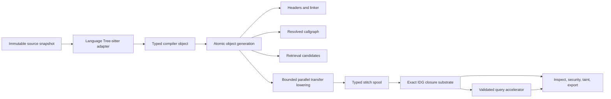

# Architecture

bonsai-ninja is a 47-crate Rust workspace. The production dependency graph is
layered: each row below depends only on its own row or a lower row. Test-only
dependencies do not define production layering. New contributors usually work
in one or two layers at a time, so this doc is organised the same way.

```
                         bonsai-ninja
                              ▲
                         bonsai_sdk
                              ▲
       bonsai_browse  bonsai_security  bonsai_conformance
                              ▲
       bonsai_inspect  bonsai_retrieval  bonsai_testkit
                              ▲
                     bonsai_workspace
                              ▲
                       bonsai_taint
                              ▲
                         bonsai_db
                              ▲
                         bonsai_idg
                              ▲
       bonsai_adapters  bonsai_callgraph  bonsai_trace
                              ▲
 bonsai_abstract_interp  bonsai_resolve  bonsai_lang_typescript
                              ▲
 bonsai_parser  bonsai_cfg  bonsai_index  bonsai_lang_* adapters
                              ▲
                       bonsai_lang_api
                              ▲
          bonsai_diagnostics  bonsai_vfs  bonsai_factstore
                              ▲
                        bonsai_common
                              ▲
                   bonsai_hash  bonsai_rulepack
```

Rows group crates by maximum production dependency depth, not by runtime phase;
for example, `bonsai_trace` is shared analysis used by `bonsai_db`, while
`bonsai_adapters` is the registry over the individual language crates. The
portable `scripts/audit-layering.sh` gate reads Cargo metadata to check normal,
build, renamed, inherited, optional, and platform-specific dependencies. It
ignores development-only edges, rejects upward production edges, and runs its
Python regression tests before auditing the workspace.

## Foundation

**`crates/common`** carries the workspace's stable IDs (`FileId`, `FuncId`,
`SymbolId`, `BasicBlockId`, `TypeId`, `ValueId`, `TraceStepId`, `PackageId`)
and metadata primitives. The compiler has one precision level: a fact is in
the graph only when it follows from syntax and resolved call flow, and call
edges carry resolver provenance rather than a precision label. Spans
are half-open byte ranges; line/column lookups go through a thread-local
`SpanMap` cache (`crates/common/src/span_cache.rs`). A `SpanMap` can also be
built from a persisted line-start table (`SpanMap::from_line_starts`,
`cached_span_map_from_line_starts`), which is how `AnalyzerDb::span_map`
renders locations for a lazily interned source without loading its text.
The line-table cache includes the unique VFS instance as well as file ID and
version; separate SDK projects cannot reuse one another's source coordinates.

`crates/common::resources` also owns resource scheduling. Memory limits are
detected from the host and the process's active nested Linux cgroup v1/v2
memory controller and each of its visible ancestors, optionally lowered by
`BONSAI_MEMORY_BUDGET_MB`. Continuous compiler worklists use each source
unit's actual byte size after subtracting the process's measured resident set
and a safety margin. The weighted scheduler charges a fixed per-unit frontend
cost plus measured source bytes, so several small files can run concurrently
under a 3 GiB budget while one genuinely large unit runs alone. IDG transfer
obtains the same exact VFS byte length through the compiler semantics provider
after linkage/resolver state is resident. Unsupported RSS probes fall back to
a conservative reserve. This is never an analysis budget. The workspace's
exact-body cache also derives its byte budget from this effective memory
limit. That cache changes how much adapter-lowered IR is retained between
exact lookups, not which IR is produced or which files are analyzed. The
budget is not an operating-system RSS limit: clean memory-mapped factstore
pages, allocator arenas, stacks, and output buffers can make RSS exceed it.
Under pressure the OS can reclaim those clean pages while Bonsai serializes,
spills, or exactly recomputes compiler bodies. Resource accounting changes
throughput and representation only.

FactStore validates its immutable string table once when opening a generation;
per-function hydration borrows that validated table without rescanning every
workspace string. Streamed serializers use the same named compiler-thread
stack reservation as lowering workers. Worker-owned temporary files are cleaned
after failures and panic unwinding as well as ordinary cancellation, without
removing the previously published generation.

Entry-rooted semantic closures use a distinct resource profile. Their shared
IDG relations are persisted, file-backed, and reclaimable, so live RSS is an
unstable concurrency input: it changes with page-cache history even when the
committed working set is identical. The scheduler instead reserves the
measured non-reclaimable linkage/output state and charges 128 MiB for each
independent sparse closure frontier. Subject to CPU availability, the current
profile permits up to ten workers at 3 GiB, two at 2 GiB, and one at 1 GiB.
This is concurrency control, not a semantic budget; every entry still reaches
the same least fixed point.

Raw workspace ingestion has a lighter schedule than parsing. The
ignore-aware directory walk (`walk_workspace_entries`) runs in parallel and
sorts its entries afterwards; one concurrent stat pass then yields both the
byte weights the batch scheduler needs and the filesystem stamps checked
against the lazy source table. Independent
source reads run concurrently in byte-weighted windows derived from the live
memory budget; each completed window is published to the VFS in canonical path
order. Consequently I/O concurrency cannot renumber `FileId`s, change the
snapshot, or create a second whole-workspace source copy on constrained hosts.

A warm open does not read unchanged sources at all. The external-cache
`manifest.json` records, for every supported source, its filesystem stamp
(length, mtime, ctime, device, inode) together with the exact text identity
(byte length, FNV-1a hash, SHA-256 digest; recorded only when the on-disk
bytes are the text verbatim, i.e. valid UTF-8). The SDK (`lazy_source_table_from_manifest`; Unix only, because only that
stamp carries ctime and device/inode) turns those records into a
`LazySourceTable` handed to
`Workspace::open_with_options_lazy_sources_and_events`; during ingest
(`stream_supported_source_files`) each admitted path whose current stamp
still matches is interned by identity (`Vfs::write_lazy`), and everything
else is read as before. `FileId` assignment, the source fingerprint, compiler-object
validation, and the sidecar source contracts all come from the identity, so
they are byte-for-byte the values an eager read would have produced. The
text is loaded on first semantic use through the VFS loader
(`install_lazy_source_loader` / `Vfs::set_lazy_loader`), which re-reads the
file and rejects it unless the length and FNV-1a hash match the recorded
`SourceIdentity`. A command that renders a handful of files therefore opens a
30k-file workspace with metadata alone. `BONSAI_DEBUG=workspace-open` reports
the interned/loaded counts (`Vfs::lazy_source_counts`), and
`BONSAI_LAZY_TRACE=1` prints a backtrace for the first three loads so an
unexpected whole-workspace read can be attributed.
Matcher body scans use one continuous work-stealing pool sized against the
largest actual source units that could overlap. They do not place a barrier
after every CPU-sized group of files.

**`crates/hash`** provides FNV-1a digests for every persisted ID. Sole API:
`fnv1a_str_slice64`, `fnv1a_names64`, `fnv1a_bytes64`, `fnv1a_low32`. RFC
vector verified.

**`crates/factstore`** is the lossless, content-addressed persistence
substrate for compiler objects and semantic sidecars. Its indexed binary
format supports atomic writers, independently decodable payloads, lazy
readers, a shared string pool, and bounded decoded-value retention. It
changes storage and reuse only; it never selects or caps semantic facts.

## Parse and ingest

**`crates/vfs`** is the file registry — single-writer, multi-reader,
versioned text snapshots, incremental edits. Case-insensitive filesystems
get folded to lowercase keys; the probe behind that decision
(`filesystem_is_case_insensitive`) is memoised per parent directory and, on
Unix, per device, so one temporary-file probe answers every directory on a
volume instead of touching each of a large workspace's directories on every
open. An entry may be interned by identity
(`write_lazy`): path, version, byte length, and identity are answered without
loading, `snapshot` loads and verifies the text on first use outside the
table lock, and any write, edit, or removal clears the lazy state.

**`crates/diagnostics`** is intentionally tiny. Phases push
`Diagnostic { span, severity, message, code, notes }` into a sink; rendering
is the consumer's job.

**`crates/parser`** is a concurrent tree-sitter parse cache keyed on VFS
identity, file, language, and version. Adapters share the exact same
`Arc<Tree>` for an immutable source snapshot. Mutable parsers are checked out
from per-language pools, so same-language files parse concurrently without a
global parser lock. It walks every ERROR/MISSING node; parsing is
uncapped by default, with `BONSAI_PARSE_TIMEOUT_MS` available for explicitly
bounded diagnostic runs.

## Knowledge ownership

The compiler boundary is enforced by what each layer is allowed to know:

- `crates/lang_*` owns Tree-sitter node/field names, grammar recovery,
  language syntax, and lowering that syntax into typed facts. An adapter may
  model a runtime construct only as a generic capability fact; it must not
  assign source, sink, sanitizer, severity, CWE, trust, or framework meaning.
- `security-patterns/langs/<language>` owns library/package/framework API
  identities and every security-sensitive inventory: call targets, argument
  roles, safe/unsafe scalar values, denied keys, character mappings, source
  trust, sink severity, CWE, and sanitizer requirements.
- `security-patterns/metadata.yml` owns pack-wide taxonomy aliases,
  dependency-manifest patterns, package aliases, security-model exceptions,
  sanitizer-credit relationships, named review profiles and their optional
  default selection, test-path patterns, adapter-visible package
  normalization/binding, and tag-level finding/guard semantic defaults.
- Shared resolver, callgraph, IDG, taint, browse, and security algorithms own
  only language-neutral IR and fixed-point logic. They must not branch on a
  language id, parse rendered source, or maintain a union of API names.
- CLI option names, persisted schema labels, canonical IR operation names,
  and workspace/cache filenames are protocol or product constants, not
  language knowledge. Keep them centralized and typed; do not move them into
  security rules.

Moving a package or API spelling from shared analysis into one adapter still
leaves security policy compiled into Rust. The normal design is
adapter-emitted syntax facts plus a rulepack-declared semantic role consumed
by one generic proof.

## Immutable compiler objects and generations

**`crates/db/src/compiler_object.rs`** is the syntax-to-semantic ownership
boundary. For each source snapshot it persists a relocatable
`CompiledFileObject` containing adapter-lowered declarations, imports, flow
events, syntax facts, and parser/adapter diagnostics. It never persists a raw
Tree-sitter tree or parser handle.

The object generation exposes independently integrity-checked projections for
imports, compact syntax targets, function attribution, normalized browse
facts, per-declaration frames, and the exact line-start table of the source
(so a span maps to a line and column without the text, which is what lets a
lazily interned source render locations unread). The declaration frames store every
declaration of the deduplicated declaration index as its own compressed
frame behind a small directory (span, local symbol, offset, digest), so a
consumer that needs one function's exact body — a rendered flow, a read-file
mark, a callee summary — decodes that declaration alone and remaps it to the
header symbol table from the directory, without decoding its siblings. The
whole-file object remains the canonical fallback. The generation file is
`compiler-objects.v178.factstore` (`COMPILER_OBJECT_CACHE_VERSION`); every
file has an object payload plus independently keyed header, attribution,
browse, declaration-frame, and line-table payloads (`load_line_starts`), and
a generation that predates line tables derives them from the text instead.
Syntax targets contain adapter-lowered calls, assignment aliases,
factory assignments, inline-callback argument bindings, typed callable
bindings, and receiver/type evidence. External callback signatures are typing
rules: the header proves which source parameter belongs to which callback,
while YAML supplies the provider call/interface and parameter types. Rule
planning first tests raw source anchors, then exact import/package headers,
then exact syntax targets. Only surviving files decompress declarations and
flow events. The full body remains the canonical source when a surviving file
needs matching, transfer, or rendered evidence; this is one compiler IR with
staged decoding, not a second parser.

Cold generation uses one bounded continuous worklist rather than a sequence of
parallel batches. A source-size-weighted permit remains held through lowering,
compression, and prepared-payload append, so faster scheduling cannot turn
into workspace-sized buffering. Completed physical payloads are appended as
workers finish; waiting for the lowest unfinished `FileId` would recreate a
head-of-line barrier. Physical payload order is not semantic: FactStore sorts
and validates its key index, and generation metadata is assembled by the
canonical file ordinal before publication. Do not reintroduce batch barriers
or an in-memory canonical reorder buffer here.

Tree-to-fact enrichment resolves an existing byte span with Tree-sitter's
range-directed descendant lookup and inspects only its ancestor chain for
same-span wrappers. Rewalking the complete CST for every emitted flow or
binding fact is quadratic frontend behavior and is forbidden. The optimized
lookup preserves the exact expected-kind, exact-span, and smallest-container
ordering of the reference tree walk; it changes lookup cost, not syntax
evidence.

A warm default `index` validates the compiler generation against the exact
root-only source fingerprint ledger before opening any source-backed
workspace. Its context summary comes from metadata-only source discovery. A
cache miss still opens the complete immutable source snapshot and rebuilds all
objects; warm validation must never become permission to accept partial or
stale coverage.

Declaration linkage headers also retain exact direct-call receiver-field
initializer facts. An adapter proves only that construction executes an
assignment such as `self.client = lower()` and records the parsed call shape;
the workspace linker resolves that call against the complete declaration set.
It admits a field type only when every surviving candidate is a constructor of
one semantic class identity. Ordinary functions, ambiguous identities, and
external calls without a typing rule fail closed. This lets broad callgraph and
IDG phases resolve cross-file receiver state after bodies have been evicted.

An unresolved competing initializer invalidates an exact field-type claim.
Resolved field types retain their qualified identity, and receiver alias
lookup preserves the complete place: `other.service` cannot borrow the type of
`self.service`. Callback relations retain each actual argument span, including
repeated callbacks, and share named/implicit-receiver formal mapping with IDG.

The TypeScript adapter preserves qualified type syntax in parameters, casts,
and inheritance. Generic arguments and operands of computed-base expressions
are not base classes. Parameter-property field transfers are independent of
whether their type is known and use the lowered parameter identity; only CST
modifiers declare properties, never decorator/comment text. Readonly literal
facts carry their class owner, and writes in that class invalidate the constant
claim regardless of textual declaration order.

Type and receiver identities are exact, case-sensitive compiler facts.
Identifier capitalization is never promoted into type evidence. A language
adapter may use case only when its grammar defines case semantically (for
example Go export visibility or Erlang variable syntax).
Nested qualified owners distinguish same-named classes, including declarations
in one file. Empty module metadata does not prove cross-file type identity or
enable same-directory callable linkage; the latter requires an explicit
adapter capability. An unresolved qualified type alias cannot fall back to an
unrelated short type name. Raw qualified calls retain every receiver segment.
Empty-base classes participate in ancestry ambiguity checks just like derived
classes, so an unrelated same-named type cannot donate its base list.

Ownership does not stop at file boundaries. An adapter records the enclosing
type even when a language permits implementations to be split across files or
modules. Rust methods retain their AST `impl Type` receiver fact and normalize
rooted crate/self/super paths into the workspace module identity; default Rust
privacy is a lexical `ModuleTree`, distinct from Java/Go exact-package
`Module`. Shared callgraph and IDG construction consume those typed facts and
never substitute a same-spelled workspace method.

The same contract applies to values. Each adapter uses one expression-value
classifier for assignments, returns, and complete call arguments; argument
shape is also stored on `CallArgumentValueFact`. Clean-overwrite accepts only
exact AST literal or adapter-decoded static-value facts. Missing carriers are
`Unknown`, never an inferred literal, and rendered argument/return text or an
ALL_CAPS identifier is never semantic evidence.
Finite-result selections use that same classifier: Kotlin `when` and Swift
`switch` results containing runtime string interpolation are not constants.
The outer string node alone is insufficient proof. Qualified Kotlin base
types retain their provider identity instead of collapsing to a short name.

When a grammar uses the same CST node for constructors and ordinary calls,
local declarations and explicit annotations remain adapter facts; external
constructor identity comes from a structured rulepack `kind: new` target.
That identity is separate from result typing. Only an explicit non-finding
`returns_type` rule may type an assigned external result, preventing sink
rules from leaking types into unrelated receiver analysis. Compact syntax
headers schedule complete workspace declaration/type resolution only when a
function-shaped constructor/type candidate survives. The body matcher then
gives exact workspace values and ordinary callables precedence over external
typing, enforces the rule's imports, and fails closed on mixed or ambiguous
identities. This replaces both capitalization and workspace-wide
constructor-name inventories without loading unrelated bodies.

Python finite-map clean-value proofs require immutable literal values, a
complete lookup RHS, and an absent or proven constant fallback. Literal
arguments do not prove an arbitrary factory's result is constant. A lookup
nested inside another expression cannot erase that expression's dataflow.
Regex-derived character constraints reject ranges crossing punctuation and
top-level alternatives that escape the enclosing anchors; unsupported proofs
remain ordinary dataflow, not sanitizer credit.
Provider-bound regex proofs also require the exact positional call shape and
the same lexical receiver binding. Additional flags, replacement limits,
shadowed receivers, and multiple concatenated character classes cannot borrow
the simpler operation's proof.
Elixir finite word-attribute guards require a unique, preceding definition in
the owning module. Repeated, conditional, dynamically defined, or custom-sigil
values cannot supply a fixed allowlist. Guard-to-call argument relations also
require unchanged bindings and cannot leak into a nested callback's scope.
Java guarded-value summaries require the rejecting branch to return a static
fallback unconditionally in that function. A return inside another conditional
or callback does not establish that proof; transparent single-statement blocks
and comments do not change it.

Rulepack-only receiver typing is compiled before IDG construction through the
same canonical matcher used for sink inventory. The result is exact
`(FileId, AST span)` evidence for each admitted receiver-mutating call, after
import, package, call-kind, workspace-shadowing, and receiver-type constraints
have all succeeded. Those spans are canonicalized into the transfer-options
fingerprint and persisted graph identity. IDG transfer consumes the typed span
evidence; it never interprets the provider, class, or method spelling. This
keeps external library semantics in YAML while making warm and cold fixed
points identical.

Compiler-synthesized constructors are language semantics and remain adapter
owned. Kotlin primary constructors lower only direct property initializers and
delegates plus `init` blocks, never computed accessors or sibling callable
bodies. Secondary constructors lower their exact `this(...)` or `super(...)`
delegation followed by the constructor block; classes that declare only
secondary constructors do not receive an invented primary constructor. Swift
lowers memberwise struct initialization, inherited
designated initializers, and implicit class initializers only when the exact
CST/declaration facts permit them. Direct instance stored-property
initializers prefix every designated initializer; static properties, computed
properties, and sibling callable bodies never become constructor events.

Parser diagnostics carry per-source-snapshot coverage. A successful file with
zero diagnostics is recorded just as deliberately as a file with an
ERROR/MISSING node. A later completeness audit runs Tree-sitter only for
unchecked snapshots and retains just their syntax diagnostics; it never lowers
declarations, imports, or flow bodies merely to compute `analysis_complete`.
An edit invalidates that parser coverage and the file's compiler diagnostic
rows. A deliberately requested full `diagnostics` inventory streams compiler
objects once because it reports adapter/lowering diagnostics as well. It must
not first parse and retain the complete workspace and then repeat compiler
lowering. Source-weighted compiler-object admission remains canonical so an
out-of-order completed object cannot retain all memory permits while an
earlier publication head waits.

Raw-anchor rule planning is also parallel but bounded by the shared compiler
worker schedule. Each worker reads one immutable VFS snapshot and the compiled
rule plan; candidate collection preserves canonical file order. This is a
planning optimization only: import/package headers, exact syntax targets, and
canonical body matching still decide the result set.

Within each language batch, literal target and package anchors are evaluated by
one multi-pattern source pass. That pass returns the candidate FileId together
with compact literal-presence and call-shape evidence; header planning reuses
the evidence and must not rescan the same source once per rule or once per
planning stage. Per-file package evidence is lazy: construct it only after a
rule's exact target survives and its package literal is absent. Its
process-local cache identity is the unique VFS instance, stable FileId,
edit-monotonic file version, and exact package-context fingerprint. Those
scheduling choices may retain extra candidates but must never change the
canonical matcher verdict.

Object identity is the workspace-relative path/module context, selected
adapter, explicit frontend ABI, and SHA-256 of the complete source. A
factstore generation contains exact per-object payload digests and a strong
generation digest. Publication is atomic. A stale generation may still supply
an unchanged content-addressed object; generation refresh copies its validated
compressed payload directly and recompiles only misses.

Every derived semantic sidecar includes the compiler-object frontend ABI in
its pipeline identity. The callgraph records and validates that ABI explicitly;
IDG, dataflow, value-flow, flow-ID, and taint-graph factstores mix it into
their pipeline hashes, and serializable compatibility snapshots carry the
same field. A lowering or compiler-object schema change therefore invalidates
products built from older facts even when the workspace source and dependency
bytes have not changed. Root-only validators reconstruct the same ABI-bound
identity as a fully opened workspace; a cheap validation path must never
accept a graph the compiler path would reject.

The partitioned resolved-callgraph sidecar also stores an independently
decodable stable-edge-ID directory. Each entry maps the existing public
low-32-bit edge digest to its exact owner partition and outgoing ordinal;
digest collisions deliberately retain every candidate and are resolved by the
normal exact edge record. `show E:<id>` must query that directory rather than
decode and hash every edge in the workspace.

The selected adapter also owns per-path grammar variants. Parser pools and
tree-cache entries include that exact grammar identity (for example
TypeScript versus TSX), and every direct adapter parse requests the same pack.
There is no CLI/parser extension switch outside the adapter registry.

`FileId` is a deterministic full-workspace source ordinal, not the insertion
position of a scoped query. Filtered and literal-prefiltered opens retain that
ordinal with sparse VFS slots. A one-file or candidate-only workspace can
therefore decode the exact same compiler object as a complete workspace
without reparsing or changing symbol identity.

Scoped broad analysis attaches an existing immutable compiler-object
generation only after every selected raw-anchor candidate matches its stable
file id, workspace-relative path, adapter, fast content hash, and SHA-256
digest. Attachment is read-only: a missing or stale generation falls back to
the owning Tree-sitter adapter and is never repaired by eagerly lowering all
candidate bodies before syntax-header filtering. This keeps import and compact
syntax-target planning exact while avoiding a full compiler pass in a warm
path-filtered workspace.



IDG transfer lowering is a continuous, source-size-admitted compiler stage.
Dedicated bounded workers may finish independent file segments out of order,
but each completed transfer retains its memory permit until the stitcher
consumes it. A bounded reorder map exposes only ascending `SegmentId` order to
the canonical stitcher, preserving stable node ids and byte-identical graph
semantics. The stitcher remains the serial publication boundary; memory policy
changes overlap only and never the scheduled segments, functions, facts, or
fixed-point scope. Do not replace this window with per-batch barriers, and do
not parallelize an earlier ordered phase without measuring its effect on later
memory admission in the complete cold pipeline.

All parser, compiler-object, transfer, summary, accelerator, and matcher pools
use the shared compiler-worker stack reservation. This is required because the
typed structured source IR retains source nesting even though Tree-sitter's
parser itself is iterative; platform-default spawned-thread stacks can abort
on valid deeply nested input. Generic read-only flow-event visitation uses an
explicit heap worklist, while stateful structured control lowering retains its
exact recursive representation on stack-hardened named workers. The ordinary
test gate includes a 2,048-region Java semantic build and a 4,096-region IDG
lowering test so a new hidden default-stack thread cannot silently return.

`index --semantic` runs compiler objects, callgraph, retrieval, linkage, and
IDG as ordered worker processes. The IDG worker also compiles the default
semantic contextual fixed point and compact node/function directories into an
independently decodable query accelerator beside the canonical graph. The
accelerator is representation-only: deleting it causes exact recomputation,
not different edges or results. The process boundary returns Tree-sitter and
allocator arenas to the OS. Later workers open the same object generation, so
the boundary does not imply another syntax interpretation. The parent then
validates every sidecar against the same current workspace snapshot; if a file
changed between workers, it reruns the exact phases until one coherent atomic
generation is current. That retry reaches quiescence without an iteration cap.

The accelerator core is a versioned fixed-width compiler header, not a generic
object-graph serialization. Its dense node/function arrays are decoded in one
buffered pass after checked row-count and byte-length validation, then checked
against the canonical workspace segment layout and stable identities. The
contextual and symbolic relations remain independently decodable streams. This
keeps startup proportional to encoded facts and prevents a warm query from
allocating a second temporary object graph beside the IDG. The symbolic
field demand — which compiler bases can reach some projected place or
aggregate read through the symbolic transform algebra, and therefore which
symbolic facts a rooted query must track — is kept at base granularity: a
bitset over bases, a sound superset of the exact field-level closure (every
field of an undemanded base is undemanded, so results are identical and
only pruning work differs). The exact field-level closure of a whole
workspace grows past tens of millions of keys and could not be loaded per
query. The IDG worker compiles the base demand once (a frontier-parallel
reverse closure that takes seconds) and persists it as its own accelerator
blob; a warm query loads it, and an accelerator without it compiles the
same demand on first use. The symbolic runtime is warmed on the calling
thread (`warm_symbolic_query_runtime`) before a parallel batch of rooted
queries starts, so no worker initialises it while the rest of the pool waits.
The persisted graph is `idg.v28.factstore` (`IDG_WORKSPACE_VERSION`). Its
accelerator container (`IDG_QUERY_ACCELERATOR_CONTAINER_VERSION = 2`) wraps
the core (`IDG_QUERY_ACCELERATOR_VERSION = 7`), contextual, and symbolic
runtime (`SYMBOLIC_RUNTIME_ACCELERATOR_VERSION = 7`) frames plus typed blobs
(`QueryAcceleratorBlobKind`; `SymbolicFieldDemand = 13` is the persisted
base-level demand). Any frame or blob change bumps the container version so
freshness probes rebuild rather than report an unusable accelerator as
current, and `validate_accelerated_sidecar_layout_with_pipeline`
distinguishes a cold canonical-only sidecar from a completed prewarm.

The linkage factstore publishes three independently decodable views of that
generation:

- a declaration/type symbol table used by syntax lookup and exact-body symbol
  rebinding; and
- finalized receiver inheritance used to enrich file-local compiler bodies
  for receiver-sensitive inventory without loading the whole symbol table;
  and
- compact AST-derived call/return linkage used by callgraph and IDG stitching.

Both carry the same source ledger, semantic ABI, declaration count, and
canonical `FileId`/`SymbolId` order. A scoped open (a `--file` or literal
scope that ingests only part of the workspace) binds its header and linkage
indexes to those persisted identities
(`Workspace::compiler_header_index_for_files` →
`persisted_compiler_header_index_for_files`, which returns `None` rather than
a locally renumbered table when no validated partition covers the scope)
instead of numbering the scoped declarations locally, so a `SymbolId` or `FuncId` recorded by one process
(a cached security row, a stable id) resolves to the same declaration in
every later process that opens the same scope. A syntax query reads only the symbol
payload. It does not deserialize call linkage and does not decode all
per-file flow-event bodies merely to discard them. File-local inventory reads
the receiver-ancestry payload, enriches the compact syntax-target header, and
filters exact import and syntax-target facts before body decode. Import
evidence is read directly from each compiler object even when optional
workspace-package prewarm has no languages, so a static import cannot be lost
at that phase boundary. Syntax-target headers include adapter-lowered call and
return targets plus exact alias/factory/callback/type evidence; return rules
therefore reject impossible files without a shared HTML/API vocabulary or a
full body decode. When a selected function needs global flow evidence,
its exact compiler object is streamed and rebound to the persisted symbol
table.

On a cold command, receiver ancestry is demand-driven. The file-local syntax
pass requests the workspace ancestry projection only when a typed call has the
right method target and a base class could change its match, or when an
explicit receiver-type constraint could change. Missing method names, regex
targets, and untyped receivers cannot trigger a whole-workspace declaration
pass. If ancestry is needed, the candidate plan is rerun with the exact base
map before any body is admitted; this changes phase scheduling, never rule
semantics.

Files deferred for ancestry retain their independently decoded syntax and
import headers. Once the receiver projection is available, planning enriches
and rechecks those same exact headers rather than reopening every deferred
compiler object. Non-deferred plans remain admitted and are never recomputed.

The global index is a linker header, not a second copy of every body. It keeps
declarations, aggregate layouts, types, modules, imports, inheritance, and
stable symbol identities. Exact consumers stream one compiler-object body at a
time, remap its file-local symbols to the header, and release it after the
memory-aware batch unless the byte-weighted hot cache retains it. This is the
large-workspace invariant: body and graph lifetimes do not multiply peak
memory, while every requested body is still analyzed exactly.

Security header and body work is one continuous CPU worklist guarded by
source-size-weighted memory permits. Small units can overlap; larger units
consume more permits and may run alone. After a rule batch survives header
planning, its exact derived-fact requirements become part of the matcher cache
identity. The body always retains canonical calls and aliases, but it derives
decorators, assignment-text chains, receiver counts, must-alias closure,
runtime narrowing, rulepack types, and lifecycle state only when a retained
constraint can consult that view. A broader later request rebuilds the exact
larger projection. Scheduling and recomputation can change; admitted facts and
matches cannot.

Source-flow compilation follows the same lifetime rule. After its exact
callgraph corridor is selected, the persisted scoped IDG streams each admitted
compiler body directly into transfer lowering. It does not populate a
workspace body/import cache first and then decode the same bodies again for
the IDG. Endpoint matcher bodies, standalone syntax headers, a previously open
canonical IDG, and the workspace callgraph cache are released at their phase
boundaries; the selected compact linkage and source corridor remain exact
inputs to the scoped graph.

## Query phase contracts

Commands request the lowest compiler product that can answer their contract:

- `tree` walks the filesystem first and never loads a rulepack, runs
  security, or opens the IDG. By default it then opens the structural
  (lazy-query) workspace and projects declarations, resolved imports, and
  cross-file call edges for the rendered files only
  (`bonsai_browse::module_map::file_connections`); a depth or child limit
  never becomes a whole-workspace projection. A cold workspace above 5,000
  files without a persisted callgraph stays a plain listing and reports
  `tree-connections-unavailable`; `--files-only` skips the compiler entirely.
- Syntax inventories stream file-local `CompiledFileObject` facts. Definitions
  and cross-file symbol labels may retain compact linker headers; none of these
  commands retains all function bodies. Broad body inventories apply file and
  compact-header predicates before decoding, schedule surviving files behind
  source-size-weighted memory permits, and sort their owned rows afterward.
  Entrypoint callee previews group roots by file, open that file's validated
  attribution directory once, and range-decode only the requested exact
  function frames behind the same source-weighted admission. Table-only
  enclosing-function labels come from compiler headers rather than reopening a
  body for every row.
- File/name/kind predicates run during the IR walk before result-row
  allocation. JSON pagination estimates serialized fields only and never reads
  text-only source-line previews.
- `read-file` opens a one-file scoped workspace by default, preserves the
  file's full-workspace ordinal from the current metadata-only source walk,
  and decodes its validated compiler object when present. An absent object
  or outdated generation cannot renumber the file or select another file's
  persisted headers. Explicit flow, rulepack, or cross-file-body options select
  workspace semantics; the default path never constructs a callgraph.
- `inspect-graph` may first narrow a large complete workspace to candidate
  files from a fresh retrieval sidecar
  (`Bonsai::retrieval_candidate_file_filters`; plain queries of at least three
  characters only, never regex), then matches compact headers and streams
  exact occurrence bodies in source-size-weighted file batches. `--kind` is a
  view over the complete cached report (`apply_kind_view`), so changing it
  re-renders instead of re-running; phase timers are emitted under
  `BONSAI_DEBUG=compiler-cache` and `page-cache`. The coordinator initializes the immutable
  linker header before file workers start; workers decode only independently
  addressable compiler bodies/import headers, and their facts are applied in
  canonical path order. Memory changes batch width only. Exact bodies are
  hydrated again only for selected rendered chains. Raw taint rows carry a
  worker-precomputed conservative presentation cost; pagination reuses it
  without serializing or rescanning the complete result set. Only the
  requested raw-taint page is formatted and cached. Stable page/cursor
  navigation still covers every row.
- Security and export retain compact linkage beside the sparse IDG and stream
  exact compiler bodies through the byte-weighted cache.
- Every IDG query reuses `IdgQueryService::global_linkage_index()`. Calling
  `AnalyzerDb::global_index()` from an IDG query is an architecture violation:
  it creates a second workspace-wide body representation and turns a warm
  graph query back into a full frontend pass. Attribution may re-lower one
  exact file through the compiler-object cache when rendered evidence needs
  body-level events.

A lazy workspace-wide cache must be initialized before entering a Rayon
file loop or outside that loop entirely. Constructing it from a worker can
deadlock a saturated pool and makes every worker wait for work that requires
the same pool. Security's serial source/sink planner therefore builds one
exact resolved callgraph and passes an immutable reference through every
finding, guard-summary, and recursive helper-attribution worker. Those workers
must never call `cached_resolved_call_graph()` themselves.
`syntax_inventory_commands_never_materialize_workspace_bodies`,
`inspect_taint_flow_uses_workspace_syntax_flow_query_facade`, and
`security_finding_workers_reuse_the_planners_resolved_callgraph`, and
`idg_taint_queries_reuse_canonical_linkage_without_global_body_materialization`
in the architecture conformance suite enforce these boundaries.

The IDG's sparse monotone queue is a compiler fixed-point solver, not a
bounded breadth-first path search. Facts are reprocessed only when the lattice
state grows, including across recursive call components, until no state
changes. There is no semantic hop, depth, iteration, file, or result ceiling.
Path previews and pages are separate rendered artifacts and report any
truncation explicitly.

## Adapter framework

**`crates/lang_api`** holds the trait every language adapter implements
plus the kit that drives ~70% of every adapter.

The `LanguageAdapter` trait is the contract: report a `LanguageId`,
declare extensions and capabilities, parse declarations and imports.
Adapters never see core internals — they get an `AdapterContext { vfs,
diagnostics, tree_provider, workspace_root }`. The optional tree provider is
the narrow bridge to the database's versioned parser cache; standalone adapter
tests can omit it.

The kit is split across several files:

- `kit/mod.rs` — `GrammarHandler`, the decl-index pipeline
  (`decl_index_with_handler`), and the match-arm split
  (`split_match_arms_in_branch_events`) for grammars that lump every arm into
  one flat `Branch`.
- `kit/walker/` — the shared flow-event walker: `assignment.rs`, `call.rs`,
  and `control.rs` (structured branch/loop/try lowering, typed catch arms,
  labeled loop control, function exit).
- `kit/bindings.rs` — pattern, `if let`/`while let`, and foreach binding
  lowering from tree-sitter fields.
- `kit/branch_conditions.rs` — `BranchConditionFact` / condition-expression
  lowering from adapter-declared operator nodes.
- `kit/call_results.rs` — `target = callee(args)` assignment-source
  normalization so dataflow crosses the call edge once.
- `kit/comments.rs`, `kit/decorators.rs` — comment/docstring and
  decorator/annotation/attribute extraction.
- `kit/direct_calls.rs` — callee path and positional argument extraction for
  call-shaped nodes.
- `kit/expression_flow.rs`, `kit/return_extraction.rs` — typed
  `ExpressionFlow` for return/yield/throw/catch values.
- `kit/flow_render.rs` — language-neutral rendering of typed flow facts.
- `kit/identifiers.rs` — identifier-shape predicates.
- `kit/param_extraction.rs` — language-neutral parameter names + grammar
  annotations; adapter-specific default-call forms remain in the owning
  adapter and lower to API-neutral compiler facts.
- `kit/pseudo_call.rs` — the adapter callback dispatch for non-call CST nodes.
  Concrete JSX, channel-send, delete, echo, subshell, eval, and operator
  grammar vocabulary remains in the owning `lang_*` crate.
- `kit/qualified.rs` — canonicalises `obj['k']`, `obj.k`, and `obj->k`
  to the same dotted form from adapter-declared fields.
- `kit/receiver_writes.rs` — `receiver_field_writes` / receiver-state source
  collection and place analysis.
- `kit/runtime_types.rs` — runtime type-test narrowing facts.
- `kit/syntax_errors.rs` — syntax-error gating: flow facts are emitted only
  from syntactically correct regions.

The kit owns language-neutral compiler mechanics: walking a Tree-sitter tree,
constructing common IR types, stable spans, and reusable algorithms over
adapter-supplied node/field facts. Each adapter owns source syntax and
semantics: grammar node kinds, declarations, imports, scopes, receivers,
constructors, module roots, exports, type spellings, exception forms, and
async/lambda boundaries. Shared analysis must not branch on language id or
carry a union of source-language tokens.

**`crates/lang_*`** — 20 adapters, one per supported language. Adapters
range from a few hundred to a few thousand lines: they declare the
`GrammarHandler`, run `decl_index_with_handler`, post-process to fill in
language-specific facts. `call_kinds`, `call_ref_kinds`, pseudo-call
callbacks, nested-call component kinds, and argument passing-mode
classification are explicit adapter-owned contracts. The internal capability
matrix tracks what each adapter handles precisely versus partially.

## Analysis core

**`crates/db`** is the compiler-object and in-memory fact database. Every
other analysis crate reads from it and writes back through it. Broad
declaration/import APIs converge on `compiler_file_object_uncached`; a narrow
uncached query can compile one missing object directly from Tree-sitter.
Compiler-object publication is cross-process locked. After publishing the
current generation, maintenance removes only recognized older schema files
whose own lock can be acquired and abandoned matching FactStore staging
files. This bounds normal upgrade residue without guessing at unknown/manual
artifacts or touching an active peer.

The persisted IDG builder lowers each function transfer exactly once. At a
file boundary it spills the canonical segment plus a compact typed stitch
record and local-to-segment node map. Stitching hydrates one segment and moves
that record into the linker; it does not reparse or re-lower the AST. Every
scheduled function and fixed-point relation is still consumed.

Before `index --semantic` publishes the immutable IDG generation, it derives
the query-ready `FuncId -> SegmentId` directory, unified numeric node
identities, and default compiler-proven contextual CSR from that same spooled
graph while retaining `Exact`/`Narrowed` edge provenance. Warm open validates array lengths, ownership, CSR offsets/targets, and
call-boundary identities before installing the accelerator. A normal cold
query may persist only the canonical graph; semantic prewarm distinguishes
that valid-but-cold artifact and completes the accelerator rather than
silently treating it as warm.

Workspace IDG generations are single-flight in process and own a
target-specific advisory lock across processes. A waiter validates and reuses
the immutable sidecar published by the current owner before doing compiler
work. It removes only well-formed FactStore staging files in the same
versioned IDG family after independently proving ownership of each target; a
hard-killed process therefore cannot strand an unbounded cache artifact, and
an active peer's staging files are never swept by filename guesswork.
Saved-file edits acquire the semantic generation guards before changing VFS
text, so one build cannot observe old indexes mixed with a new source
snapshot.

Interprocedural return summaries are compiled from structural call boundaries
identified by caller, resolved callee, and exact call span. The compiler
streams the canonical segments once to build compact function layouts, numeric
node addresses, ordinary local-edge pages, and call-boundary spools. The
fixed-point loop reconstructs one function-local CSR from those fixed-width
pages, composes the current callee summaries, and requeues callers whenever a
callee summary grows. Recursive and mutually recursive components therefore
reach their least fixed point without a depth, iteration, or graph-size cap.
The bounded page cache changes I/O locality only: evicted pages are reread from
the complete spool, never omitted. The contextual query runtime reuses the
outer decoded segment for same-segment receiver-state projection. It groups
cross-segment projected edges by the exact `(from_segment, to_segment)` pair
and opens each pair once; it must not reopen and MessagePack-decode both
segments once per projected edge. It stores matched call and return boundaries
in sorted sparse source rows and does not retain a second workspace-sized
endpoint relation.

Symbolic field flow is compiled into numeric access-path facts and algebraic
transforms emitted from the adapter-lowered AST. Query setup streams the
persisted transform relation once through bounded external sort runs, then
stores every transform field in a fixed-width, source-indexed temporary
relation. Node facts use the same fixed-width paging pattern. Broad closures
therefore read exact numeric rows without repeatedly decoding whole IDG
segments or MessagePack transform chunks. Page-cache size can change I/O and
latency, but never the transform set or closure result. Multi-parameter return
summaries may first evaluate the union of all remaining formal seeds; a
negative union is a proof that each member is negative, while positive unions
are still checked per parameter. This removes redundant work without changing
the least fixed point.

Field admission is sparse and AST-demanded. The persisted symbolic runtime
records exact projected fact keys plus a grouped relation for compiler-proven
whole-aggregate consumers. The latter comes only from the non-traversable
`IntraAggregateConsume` marker emitted during transfer lowering; ordinary
reads and unresolved name similarity do not create wildcard demand. Demand is
propagated backwards through symbolic transforms with lazy spill-backed sets.
This preserves real aggregate consumers without allocating a workspace-wide
base-by-field relation or letting one projected field taint its siblings.

Targeted queries may compile a sparse backward relevance relation before the
forward closure. That relation is only a pruning proof and records whether its
symbolic inversion is complete. If a requested projection has no invertible
persisted fact, the proof is incomplete and therefore admits unproven nodes
and facts instead of removing them. Because one failed inverse makes the
relation globally non-pruning, construction stops at that first proof failure
instead of walking nodes whose membership cannot be used. The exact forward
IDG fixed point remains the semantic authority. This fail-open optimization
contract preserves paths through scalar call boundaries without inventing
sibling-field propagation.

Closure reached sets use sorted external runs, while pending LIFO frontiers
store all spilled chunks in one append-only temporary file and truncate
consumed tails. Memory scheduling therefore remains exact without making file
descriptor use proportional to closure fan-out.

These external representations are lazy. Normal function-sized closures begin
with empty sparse sets and in-memory frontiers. A dense workspace bitset is
allocated only when reached-node density makes it smaller than the sparse
representation; positive/Bloom acceleration and temporary files are allocated
only on the first actual spill. This matters because return-summary
compilation creates many independent fixed points. Eagerly reserving each
fixed point's maximum spill page makes large-project latency proportional to
allocator and file setup rather than compiler facts. Unit and architecture
conformance tests pin the lazy boundary.

Fixed-width relation sorters follow the same rule: an empty sorter owns no run
buffer or temporary file, and a relation below its run threshold sorts and
deduplicates in memory. Larger relations spill to bounded sorted runs and use
the same positioned merge. Resident and spilled relations have identical
range-query results, checkpoints, and persisted record bytes; the storage
choice does not change the graph or its admitted facts.

Large compiler phases transfer only their canonical result across a scoped
worker-heap boundary. Transient maps, sort buffers, and CSR construction state
are released before the next phase begins. This is allocation-lifetime
isolation, not parallel semantic execution or a result budget: every compiler
unit and fixed-point relation is still evaluated.

Memory-bounded export may unload the resident IDG between compiler and
presentation phases. The workspace retains only the validated pipeline hash
for the current immutable source generation, so reloading the same sidecar
does not rescan the source and dependency trees. Any source edit clears that
token together with the IDG and other semantic caches. A frontend ABI or
transfer-semantic version change produces a different pipeline hash and cannot
reuse the prior graph.

**`crates/idg`** owns this canonical interprocedural dataflow graph: numeric
places and nodes, transfer lowering, per-file segments, exact cross-file
stitching, symbolic access-path transforms, persisted query accelerators, and
the sparse fixed-point query service. Security, inspect, dump-taint, export,
and the compatibility taint facade all consume the same graph; they do not
maintain separate interprocedural engines.

Native export has one exact call-relation representation: the resolved
callgraph. It never enumerates simple paths or exposes a capped/BFS prefix
mode through the CLI or SDK; dense cyclic graphs would make that product
exponential. A `complete_chains` switch is intentionally absent, while schema
compatibility fields report
`mode=compressed_callgraph`, zero truncation, and explain that concrete path
rows are represented by the graph.
Since schema v7 (the current schema is v13,
`schemas/bonsai-native-export-v13.schema.json`) code locations are serialized
relative to the workspace root, with that absolute root carried once as
metadata. The relative path is the stable compiler
identity; absolute paths are reconstructed only when a consumer performs host
filesystem I/O. Changing this contract requires a native-schema and export
cache version bump together.

Export phase ownership is sequential and enforced by conformance tests:

1. compiler linkage and the single canonical resolved callgraph drive
   structural edges and graph-backed presentation;
2. callgraph rows are serialized, resident flow labels are released, and all
   callgraph owners are dropped together;
3. file-local reachable/intra/alias/class/entry facts stream from exact
   compiler objects, then the exact-body cache is released; and
4. only then is the canonical IDG opened for assignment/propagation
   projection.

Flow-ID rendering receives the already-open compiler header and canonical
callgraph. It must not call `AnalyzerDb::global_index()`, construct a second
workspace name/adjacency table, or reparse source. A one-shot export streams
directly into its requested writer. Only explicit `cache rebuild --export`
publishes the reusable default artifact, so a cache miss never creates a
multi-gigabyte temporary copy beside the requested output.

**`crates/retrieval`** is a fact-backed candidate index, not an evidence
engine. It persists `FactDoc` records in the external workspace cache with stable fact ids,
source spans, language/file/symbol metadata, provenance,
static-limit/incomplete metadata, normalized search text, content
fingerprints, and pipeline fingerprints. Source files are first-class
`kind=file` documents in the same sidecar, so file lookup is cached without
turning filenames into evidence. It builds deterministic indexes for
stable ids, kind, file, symbol/name, lexical trigrams, and caller/callee edges.
Substring queries shorter than three Unicode scalars scan candidate text;
token-prefix membership cannot exclude matches inside longer identifiers.
Longer queries intersect sorted trigram postings beginning with the smallest
list, without allocating a hash set for every trigram. Unused token/prefix
indexes are not built.

Exact indexes decide candidates; canonical facts and semantic graph
verification decide truth. Vector similarity is never evidence. Future vector
rankers may return candidate `fact_id`s only; renderers must hydrate those ids
through browse, resolver, graph, value-flow, IDG, or taint APIs before showing
public analysis facts. Search and literal-filtered browse commands can use
retrieval to narrow repeated candidate lookup, then render the same canonical
rows/chains they rendered before retrieval existed. Large-workspace inspect
can use a warmed retrieval sidecar only before opening a scoped workspace; it
does not apply a second retrieval gate after canonical facts are loaded.
Retrieval candidate docs include declaration parameters, operation facts,
imports, refs, comments, strings, variables, calls, files, and edge metadata;
those docs select files/fact ids only and are not rendered as evidence.
User-facing file filters are applied relative to the selected workspace, even
when persisted candidate docs carry canonical or absolute paths for stable
identity. Retrieval sidecars are only persisted for complete workspace indexes.
Literal-, file-, and filter-scoped query workspaces may render exact canonical
facts, but they never publish partial retrieval factstores as reusable
whole-workspace cache state. Large complete workspaces also avoid surprise
query-time retrieval builds. Query frontends can validate a warmed sidecar from
disk source fingerprints and use its candidate file/fact ids before opening a
scoped workspace; stale or missing sidecars fall back to canonical syntax-backed
collection. Use `index --semantic` or `cache rebuild` when you want to
front-load that candidate index.

Retrieval pipeline identity includes both the compiler-object frontend ABI and
shared semantic-policy fingerprint, as well as source, dependency, and schema
identities. Query-time Bloom page validation requires each file partition
exactly once in canonical order; incomplete or duplicate coverage is an error,
not an empty result. Migration cleanup recognizes numeric older schema
versions only and leaves newer binaries' sidecars intact.

**`crates/index`** is the cross-file declaration/reference index: it remaps
each adapter's file-local `DeclIndex` symbols to workspace-unique
`SymbolId`s (`GlobalIndex`) while keeping the `(FileId, local_symbol)` pair
recoverable.

**`crates/resolve`** turns names into symbols. Reads import maps,
type aliases, base classes, module paths; emits `Ref { resolved: Some(...) }`
edges.

**`crates/cfg`** builds basic-block control-flow graphs from `flow_events`.
Used by `taint` and by `dump-cfg`.

**`crates/callgraph`** walks the resolved graph and surfaces
`(caller, callee, kind, provenance)` edges, with virtual-dispatch
expansion via the bases facts. Provenance records the resolver stage,
evidence, and confidence for each accepted edge; dump, SDK, and export
surfaces forward that metadata without re-resolving. It also binds local
callable aliases, receiver-projected callable storage (`obj.cb`,
`self.cb`, `obj->cb`), and uniquely returned closure factories so
indirect callback calls stay resolver-backed instead of becoming
name-only fan-out.

The corridor engine (`bonsai_browse::paths`, exposed as `inspect-graph
--from/--to` on the CLI and `paths` in the SDK) builds an exact compressed
corridor from the cached resolved callgraph
plus warmed IDG cross-call edges when an IDG sidecar has been hydrated.
Forward/reverse fixed points retain every compiler-proven node and edge that is
both reachable from a selected source and able to reach a selected target.
The engine never enumerates concrete path combinations, so diamonds and
cycles remain linear in graph size. Edge kind and resolver provenance
stay attached to the compressed relation. Missing IDG facts or resolution
gaps mark the result incomplete rather than widening missing calls into
guessed evidence. When the target pattern matches an indexed call site but no
callable declaration (for example an external API), the corridor retains the
corridor only to the enclosing callable and attaches `terminal_call` evidence
for the call site. It never fabricates a callee node for the external API.

The SDK trace interpreter (`project.trace()`; there is no CLI trace command)
runs a targeted from/to query over the selected semantic corridor. Calls
outside that corridor are intentionally omitted evidence, not unresolved
workspace calls, so they do not make an otherwise exact trace incomplete. A
successful target hit terminates as `ReachedTarget`; a missing target is
reported explicitly. This keeps trace completeness tied to the requested
compiler graph rather than to unrelated sibling branches.
Trace finalization preserves the absolute workspace root once as metadata and
normalizes every step/module/span location to a workspace-relative path. The
SDK `read-file` aggregator applies the same contract after composing all
nested finding, flow, caller/callee, and taint-hop locators; internal source
hydration joins those paths back to exact `FileId`s through the VFS.

The SDK backwards slice (`bonsai_browse::slices`, `SliceOutcome`) is the
counterpart for "what influences this symbol?" It has no CLI command; on the
command line, combine `inspect-graph --query` on the symbol with `refs` /
`vars` for read and write sites. The engine identifies exact adapter-emitted
symbol sites first and infers the
line when one site survives; ambiguous sites require an explicit line and
optionally a file filter. It projects the selected callable's shared value-flow/IDG
graph on demand (reusing a compatible cached entry when present), then merges adapter-emitted
`FlowEvent` facts for local syntax detail: assignments, call arguments,
returns, structured branches/loops, and lifecycle/use-site events. It does
not parse raw source, require an all-entry compatibility prewarm, or invent missing edges; unavailable semantic graphs,
parameter boundaries, and unresolved caller boundaries are reported through
`analysis_incomplete_reasons`, and rows expose their `backends` so users
can see whether evidence came from `value-flow`, `flow-events`, or both.

`operations` promotes those same `FlowEvent` facts into first-class
use-site rows: reads, writes, calls, constructor allocations, returns,
throws, awaits, branch conditions, catch bindings, resource scopes,
lifecycle releases, and normalized place shapes such as field access,
indexing, and dereference-like use. The conversion lives in
`bonsai_lang_api::operations_from_flow_events`, so browse, SDK, security,
and future abstract-interpretation consumers all share the same
syntax-derived operation vocabulary instead of re-parsing source text.
Exact branch-condition boundaries and negation polarity live beside those
events as `BranchConditionFact` compiler IR and are included in native export;
semantic guard proofs consume that fact rather than branch rendering.
Condition operands additionally carry adapter-decoded `StaticScalarValue`
facts, including null and booleans, so control-dependent proofs never infer
literal meaning from rendered condition text. Direct call operands and
call-backed type tests carry their canonical callee span independently of the
complete condition and tested value. Dart's flattened selector sequences
preserve the parsed conjunction, disjunction, and negation structure; an
opaque outer call does not inherit an inner predicate's result.

Broad duplicate projections
(such as a loop-binding assignment that shares the complete loop span) cannot
terminate a control-path walk before the tighter structured sibling.

Browse attribution uses half-open callable extents and one-based byte columns,
so same-line siblings have distinct names, summary IDs, and cross-module
uses. Line-only SDK lookups fail closed when sibling scopes are ambiguous.
The annotator shares immutable per-file header ranges and invalidates its
paths and symbol ordinals on VFS revisions; it never hydrates source merely
to render a location when compiler line tables are available.
Incoming browse edges join stable callable IDs, and class rows select members
by their exact parent symbol. A scoped view without complete callgraph
partitions reports optional `used_in` evidence as incomplete; rendered-page
caching must not preserve that absence across an explicit semantic prewarm.
Remote call-site coordinates use source fingerprints from the validated
generation, never a guessed column or unchecked current disk contents.

C# constructor initializer calls preserve their current-object receiver;
ancestor and overload effects compose in the IDG. Adapters do not run a
separate depth-limited constructor fixed point or borrow writes from another
object created in the constructor body. C# configuration constants propagated
from a local object initializer require an unescaped same-block read; writes,
aliases, conditional definitions, and argument-evaluation mutations invalidate
that optional static proof.

`dump-resolution` audits the same layer without adding a second resolver:
it compares adapter-emitted `FlowEvent::Call` sites with the canonical
resolved call graph and reports per-file / per-decl resolution coverage,
known external/library call sites, unresolved call sites, dynamic calls, macro
calls, and receiver-type fact gaps. The output is syntax-derived and
completeness-oriented; it never widens a missing edge into guessed evidence,
and it does not treat import-proven external API calls as receiver-type gaps.
When a fresh partitioned callgraph is available, aggregate export completeness
streams one caller-file partition and one exact compiler body at a time, then
replays this same classification. Cached and uncached reports therefore count
the same call sites without retaining the whole graph beside all bodies.

`dump-resolve` is the call-site drilldown over that same evidence. `--in-file`
and optional `--line` select an exact adapter-lowered `FlowEvent::Call`, then
join its span to the persisted partitioned callgraph. On a cold cache the
workspace reads complete linkage headers and decodes only the selected file's
body; it never rebuilds every body just to resolve one call. Multiple
compiler-justified virtual targets are complete/narrowed, an import-proven
external call is complete/external, and only a genuinely unresolved site exits
incomplete. Compiler-qualified identities printed by `defs` also round-trip
directly into `dump-hir` and `dump-cfg`; those commands never recover a target
with a raw-source name guess.

**`crates/abstract_interp`** is the shared abstract-interpretation
runtime. Its value lattice now carries constants, bounded integer ranges,
boolean domains, string length ranges, nullness / nullable values, bounded
literal sets, and simple path relations such as `idx < len` or `ptr !=
null`. The diagnostic trace runner consumes sorted adapter-lowered
`AssignmentValueFact.static_value` facts and exact bare-name copies; it never
decodes source-language literals or assumes a call returns its arguments.
At CFG joins, proven numeric facts widen into ranges; a binding missing on any
incoming path becomes unknown. CFG incompleteness is preserved in the trace.
Security, browse, and export consumers should sharpen results by consuming
these shared facts rather than inventing command- or language-specific
domains.

**`crates/taint`** owns taint reachability and source-specific graph
construction. All interprocedural taint surfaces are IDG-backed: source seeds are
resolved to concrete IDG nodes, configured transfer summaries are applied to
fixpoint, and the resulting closure is cut to a semantic target/lineage
corridor before call records or findings are rendered.
Projected state shared through an imported module/singleton binding is linked
only at an exact resolved call site with matching compiler import identity.
That relation may parent downstream evidence without inventing a positional
argument; allocation-insensitive heap relations remain closure-only and are
not rendered as calls.
After `index --semantic`, the first query decodes and validates the persisted
default semantic CSR and compact identity directories without reopening every
IDG segment. A valid canonical graph without that optional accelerator builds
the same forward/backward adjacency in two streaming passes on demand. Neither
path stages a second workspace-sized endpoint vector, performs name search, or
changes the edge set. A dense
function corridor may reuse an already-prewarmed global representation while
the closure still enforces the exact admitted function set at every
transition; cold and genuinely narrow corridors retain sparse projections.
`interprocedural_taint_with_caches` is a compatibility façade over that same
closure, not a second scheduler. `reachable.rs` also owns the
shared default entry seed helpers used by cached dataflow, inspect, and
`dump-taint`; command crates should not carry local copies of the
params/assignment-target/bare-call-argument seed logic. Sub-modules:

- `intra.rs` — single-function taint propagation over `flow_events`.
- `idg_api.rs` — IDG-backed public compatibility types and entry points.
- `idg_api/summary.rs` — IDG-derived function-return summaries.
- `idg_build.rs` — builds and caches the IDG service directly from an
  `AnalyzerDb` so bare-db callers query the same graph as a `Workspace`.
- `idg_query.rs` — typed query descriptors (source semantics, transfers,
  target scope, cache reuse) executed by `reachable.rs`.
- `tokens.rs` — receiver/method projection token helpers.
- `assignment.rs` — assignment effect calculation.
- `reachable.rs` — IDG-backed source-seeded graph builders, filtered
  call-record export, and semantic reachability helpers used by security,
  source-analysis, sink-analysis, and debug commands.
- `text.rs` — text-level normalisation shared with adapters (the engine
  side of the qualified-text canonicalisation).
- `value_flow.rs` — value-flow graph used by `dump-edges` and the
  call-site narrowing path.

## Workspace facade

**`crates/workspace`** is the one-stop API consumed by `cli`, `sdk`, and
`security`. It hides the orchestration: index a directory, run analysis,
return facts.

Workspace semantic context also lives here. `Workspace::semantic_context`
and SDK `Project::semantic_context()` expose one language-neutral model
for module roots, dependency/generated/excluded roots, toolchain
manifests, configured-source hints, and source-transformation evidence;
adapters consume normalized context instead of inventing local workspace
rules.

The workspace owns a battery of lazy caches and explicit prewarm paths.
Default CLI query commands parse/index structurally, load valid persisted
sidecars when present, and compute missing facts for the requested scope
before rendering. The workspace open path emits SDK-visible
`WorkspaceOpenEvent::CacheChecked` records for sidecar hits, misses,
skips, and errors; the CLI renders those as stderr notes while progress
is enabled, and clears any previous phase bar before replacing it so
interactive output does not accumulate duplicate wheels.

The reuse path is binary factstores, not JSON re-parsing. Cache producers —
structural `index` after it rebuilds the compiler generation (and on a warm
hit whenever `WorkspaceCache::manifest_needs_republish` reports an older
schema, a different workspace root, or a different minified-source profile),
`index --semantic`, SDK `Bonsai::index_semantic`, and `cache rebuild` — write
`manifest.json` (`CACHE_MANIFEST_SCHEMA_VERSION = 8`) in the external
workspace cache: a descriptive JSON inventory of sidecar coverage, producer
fingerprints, missing reasons, and a versioned source ledger. Each
`CacheManifestSourceFile` stores the path's filesystem stamp, FNV-1a hash,
and, when the bytes are the text verbatim, its SHA-256 `text_digest`. A warm
validation reuses the digest only when the stamp is unchanged; changed
metadata always rehashes content. This turns an unchanged 30,000-file reopen
into metadata validation without weakening exact source identity. Legacy
in-tree analysis files are not reused. `cache stats` reports recognized
inactive `<workspace>/.bonsai` artifacts; `cache clear --legacy`
(`WorkspaceCache::clear_legacy_in_tree`) removes only those files, preserving
rule overlays, links, configuration, and unknown data. Ordinary recursive
cache clearing requires matching native ownership, rejects source roots and
ancestors, and preflights unknown entries. Orphan pruning uses the same native
workspace binding, with complete legacy manifests as a fallback; missing
manifests or old timestamps never justify deletion. A shared lock serializes
the daily sweep. Compiler-object generation cleanup belongs to the compiler
writer, which checks older numeric versions and their writer locks; the SDK
does not run a competing filename-based pruner.
The old v11 container migration is retired: it cannot prove that its lowered
IR matches the current adapter ABI. Incompatible generations take the normal
compiler rebuild path, even when their source hashes still match. The public
migration compatibility hook returns no migrated generation without decoding
or rewriting the old object bodies.
The native workspace binding takes precedence even when an explicitly selected
external cache happens to be named `.bonsai`; its parent is not necessarily
the inspected project.
Reusable export readers capture an open immutable payload and its matching
metadata under a short shared publisher lock. A busy publisher is a cache
miss, not a blocking read; streaming proceeds after releasing the lock.
Publishers invalidate previous metadata before replacing payload bytes, so
an interrupted publication cannot make one generation borrow another's
freshness proof. Ordinary one-shot exports still do not publish this cache.
Commands still validate each sidecar's own header, payload index, and
pipeline fingerprint before reuse; the manifest is for diagnostics, SDK
consumers, and downstream tooling that need to understand what was produced.
The retrieval factstore is
part of the structural semantic coverage set: it speeds candidate lookup for
search/inspect/browse surfaces but cannot create calls, edges, flows,
findings, or refs by itself. Large query commands may validate the retrieval
factstore from source/dependency/schema fingerprints before workspace open,
but they still hydrate through canonical APIs before rendering.
`cache stats` and `WorkspaceCache::stats()` validate the manifest against the
current workspace and decode reported sidecar payloads where possible, so
diagnostics report reusable facts rather than raw file presence or stale
same-size artifacts. Retrieval payload validation uses the same query-time
source/dependency/schema pipeline fingerprint, which rejects copied or moved
candidate indexes before they can narrow a query.

- `DataFlowCache` (`dataflow.rs`) — compatibility per-function tokens, entry
  graph, and transitive-dependency set. Its exact prewarm, persistence, and
  invalidation contract is specified once under
  [Workspace-level result caches](taint-engine-spec.mdx#workspace-level-result-caches).
- `SyntaxFlowQuery` (`flow_query.rs`) — the command-facing facade for
  rulepack-free entry taint graphs. Inspect first records exact Tree-sitter
  match spans and releases syntax-body/callgraph ownership before opening a
  persisted IDG. The facade batch-resolves those spans to typed IDG target
  nodes, keeps function fallbacks only for unrepresented spans, and reuses one
  sparse backward target-relevance proof across exact per-entry closures. An
  incomplete symbolic inverse makes that proof non-pruning; it never narrows
  semantic work without a completeness proof. A
  warmed IDG answers the target cut; a cache miss builds one exact
  query-scoped source/target IDG, with `DataFlowCache` retained only as the
  compatibility fallback. Each result carries a `SyntaxFlowPlan` with the
  selected backend, cache hit/miss status, target-cut scope, IDG availability,
  and fallback/incompleteness reasons. Interactive commands use this instead
  of open-coding IDG/dataflow selection or hiding planner decisions in
  render-only logic.
- `ValueFlowCache` (`value_flow.rs`) — per-`FuncId` seed-free
  `ValueFlowGraph` plus a `returning_seed_names` set
  for compatibility navigation/SDK clients. Loaded when present and projected
  from the canonical IDG only for the requested scope; explicit callers may
  persist it to external-cache `value_flow.v*.factstore`. Security and native export
  query the IDG directly.
- `FlowIdCache` (`flow_ids.rs`) — per-`FuncId` flow labels for
  browse-row F-IDs. Computed for the rendered browse scope; shares the
  workspace-cached resolved call graph via `seed_call_graph` when that
  graph is already available.
- `TaintGraphIndex` (`taint_index.rs`) — workspace-wide
  `(source_func, sorted_seed_key) → Arc<EntryTaintGraph>`. Lifted
  out of the per-invocation map so a second `taint-analysis`,
  `source-analysis`, or `sink-analysis` run reuses the cached graph. Persisted to
  external-cache `taint_graph.v*.<mode>.<config>.factstore` with version + fingerprint
  guard, so different analysis configurations do not evict each other.
  Write-through persistence is default-on and can be disabled with
  `BONSAI_TAINT_GRAPH_PERSIST=0` when cache I/O is undesirable.
  Security analysis reports the cache decision through
  `AnalysisProgress::Note`, including whether the run was a memory hit,
  disk hit, miss, or config invalidation.
- `ClassMemberIndex` (`class_index.rs`) —
  `(class_sym, method_name) → Vec<FuncId>` and `class_sym →
  constructor FuncIds`. Replaces per-resolution linear scans of
  `decls_in(class_file)`.
- `EnclosingIndex` (`enclosing_index.rs`) — per-file
  binary-searchable enclosing-decl span array. `O(log decls in
  file)` "what decl contains this position?" lookups.
- `DeclNameIndex` (`decl_name_index.rs`) — workspace-wide
  lowercased decl-name table for `inspect-graph --query <pat>`
  `Contains` matching.
- `ExactBodyCache` (`exact_body_cache.rs`) — single-flight, byte-weighted LRU
  for exact per-file `DeclIndex` bodies. Entries are keyed by file and VFS
  version, charged from source size, and retained within a fraction of the
  effective process memory budget. Read-only consumers share the same
  `Arc<DeclIndex>` through `exact_decl_index_shared`; the compatibility owned
  API clones only when requested. An entry larger than the hot-cache budget is
  returned normally and evicted immediately. Eviction therefore trades
  repeated adapter lowering for memory and never truncates compiler work.
- `cached_resolved_call_graph()` — singleton
  `Arc<ResolvedCallGraph>` shared with `inspect-graph`, `security`,
  `dump-callgraph`, the dataflow + flow-id caches.
- `inter_taint_caches()` — workspace-wide singleton
  `bonsai_taint::InterTaintCaches` so the engine's resolver memo,
  alias maps, function summaries, and local bindings survive
  across security/value-flow/inspect runs in one CLI process.

Every cache is interior-mutable (`parking_lot::RwLock` /
`Mutex`) and safe to share across rayon worker threads.
`Workspace::ingest_dir` clears or invalidates each cache when a
file edit lands so subsequent queries observe current state. Exact-body
single-flight cells prevent concurrent consumers from lowering the same
retained file snapshot more than once. Every public security operation that
can consult package evidence—source, sink, and sanitizer inventory plus
source/sink/taint analysis—owns one immutable dependency-manifest package snapshot
because manifests such as `requirements.txt` are not necessarily VFS compiler
inputs. Broad matching and later point constraint rechecks share that
snapshot, so a concurrent save cannot mix old endpoint evidence with new
package facts.

## Security

**`crates/security`** is the rulepack matcher and findings pipeline. It loads
YAML rules from `security-patterns/`, compiles them into matcher state
machines, selects source value nodes from the value-flow graph, augments those
with strict source-site facts, and builds source-specific IDG taint graphs to
emit findings. `taint-analysis` first narrows each source group to a
source-to-sink callgraph/IDG corridor, then propagates only through that
semantic corridor. `source-analysis` uses a source-lineage corridor from the
resolved callgraph, including summary-output caller support, and seeds a scoped
IDG over only the files/functions needed for the rendered lineage.
`sink-analysis` runs the shared sink endpoint matcher, compiles one
sink-relevant compiler/IDG scope, and validates candidate value origins
forward against exact sink nodes. Lineage is composed from function-local
summaries (`crates/security/src/analysis/sink_lineage.rs`): every admitted
function is analysed once per entering value — one IDG closure confined to
that function per parameter, one per storage read another summary writes
tainted, and one over all places of an entry point (an admitted function no
admitted function calls, or a member of a call cycle no entry point reaches).
Callee returns compose through the IDG's contextual return summaries inside
those closures, so no closure re-explores a callee body. The summaries form a
graph of `(function, entering value)` nodes joined by tainted call arguments
and tainted storage writes; a route is a path from an entry point to a sink
hit, and one route survives per sink endpoint and direct feeder. Work is
proportional to functions × entering values, never to entry points × sinks.
A sink no entry point feeds is traced inside its own function, to its own
sink nodes only. Source-to-sink security proofs are a
separate demand-driven matcher enrichment under the same endpoint; the
default source-independent view does not scan source rules, and source filters
cannot erase compiler lineage. It does not run a backward graph walk per sink. None of these surfaces uses
whole-workspace per-source/per-sink traversal for production evidence. On a
fresh partitioned callgraph, the security scopes replay the
same uncapped forward, summary-output reverse, target-return, provider, and
callback fixed point directly over validated file relations. A cache miss or
integrity failure falls back to exact adapter-body resolution; storage warmth
cannot change the selected functions or edges. Canonical callgraph generation
uses the compiler's exact function-linkage payload as well as declaration/type
headers, so persisted factory-return and receiver dispatch remain identical to
a scoped cold compile. The broader workspace dataflow
sidecar remains a compatibility cache for navigation and older SDK/query
surfaces; native export reads the canonical IDG. The output formats (text /
JSON / SARIF) live in `report.rs`. Text flow evidence shares one source-body
cache across a report and retains structured page units until the requested
page is rendered. Sanitizer-credit calculation has its own generic module;
the credit taxonomy lives in `security-patterns/metadata.yml`.

**`security-patterns` / `bonsai_rulepack`** owns the source-controlled YAML
and compiles only those rule files into a deterministic archive. The security
crate consumes that archive through a normal versioned dependency, so a
crates.io build embeds the exact default pack without a repository-relative
filesystem lookup. Package/API identities and security meaning remain in YAML;
the rulepack crate contributes no second matcher or language logic. Cache
fingerprints use the loader's canonical semantic inventory (`VERSION`, the
selected metadata file, and YAML in canonical or flat rule buckets), so Cargo
packaging files and documentation cannot make source and embedded copies of
the same rules appear different.

## Query / browse / trace

**`crates/inspect`** supplies matching, filtering, stable-id, and bounded memo
primitives for `inspect-graph`. Structural graph-flow output owns one source-backed
evidence unit per matching callable; it does not enumerate recursive caller
paths. Each declaration hit carries the corresponding declaration packet
(signature, direct resolved callers/callees with `E:` edge ids, external
calls, imports) from `bonsai_browse::symbol_summaries`, including
adapter-proven parameter dispatch that has no resolved binding. Structural `F:`/`G:`
ids hash exact compiler identities. The CLI records the full originating query provenance,
including qualified from/to identities and kind/file/function filters, so a
later `show` reopens the same scoped corridor. Lexical-tail matching used
inside an already-proven corridor is presentation state and must never replace
that provenance.

**`crates/browse`** powers the browse commands (`defs`, `calls`,
`imports`, `refs`, `vars`, `strings`, `args`, `operations`, `classes`,
`comments`, `search`, `read-file`, `tree`) plus the SDK-facing
`symbol_summaries`, `paths`, and `slices` engines that back `inspect-graph`
declaration facts and `--from`/`--to` corridors. Most commands
share the same plumbing: read facts from the db, rank query-shaped rows
before pagination, paginate, format. The shared textual relevance helper
ranks plain filters as exact > prefix > substring while regex filters
retain the deterministic structural order; the ranking happens in the
browse data layer so CLI and SDK ordering cannot drift.

**`crates/trace`** owns the stable text, JSON, and DOT trace schema behind
the SDK `project.trace()` API; the CLI has no trace command.
Finalization pins each file snapshot so displayed source and line coordinates
cannot drift during an SDK edit, and retrieves each selected line without
rescanning the file prefix. Edges connect consecutive steps within each path,
even when paths interleave. Special edge labels require typed destination
evidence: an unexpanded call is not a callee entry, and a branch split alone
does not prove a true/false verdict. DOT labels escape source text.
`crates/workspace` resolves adapter-emitted callable identities and drives the
cross-module interpreter. A declared source/target query projects the
resolved graph with an uncapped linear reverse/forward reachability pass
before interpretation; sibling/downstream branches are never interpreted and
discarded afterward. An external target has no compiler declaration, so that
shape retains source-reachable interpretation and terminates on the exact
call step. Presentation paging never changes either semantic scope.

## CLI / SDK

**`crates/cli`** is the binary. Each subcommand lives in
`src/commands/`. Cross-cutting concerns (paging, progress, theme, footer)
sit alongside.

**`crates/sdk`** is the Rust API. Same surface as the CLI, just exposed as
a `Bonsai` builder. Tests under `crates/sdk/tests/` exercise the public
shape.

The CLI is a renderer over the SDK-facing engines. Long-running security
analysis emits `AnalysisProgress` events; the CLI turns phases into progress
bars and notes into stderr lines, while SDK consumers receive the same
scope/cache facts directly.

**`crates/adapters`** registers all 20 language adapters into a
`LanguageRegistry`. Used by `cli`, `sdk`, and the conformance suite.

## Tests / supporting crates

**`crates/conformance`** is the architectural-invariant test suite:
language-gauntlet, single-engine-path checks, drift gates against the snapshots
under `docs/`.

**`crates/testkit`** is shared test helpers — workspace fixtures,
result assertions, finding-shape matchers.

Unit tests live beside the production module in separate files (`*_tests.rs`
or crate-root `tests.rs`) and are included through `#[cfg(test)]` module
declarations. This keeps long regression fixtures out of production modules
while preserving access to private helpers through `use super::*;`.

## Dataflow at a glance

The pipeline is demand-driven. Default `index` performs syntax/construct
stages 1–4. `index --semantic` and query commands build the exact semantic
stages they request from 5–7 plus the streamed IDG. Explicit compatibility
full-prewarm paths can additionally materialize stages 8–10:

1. `vfs` interns paths and stores text.
2. `parser` parses each file (with cache).
3. The right `lang_*` adapter walks the tree and emits `Decl` / `Ref` /
   `ImportSpec`.
4. The DB/index path links adapter-emitted import and receiver facts, marks
   module/type qualifiers as non-value receivers unless local binding facts
   prove shadowing, and enriches runtime receiver types from adapter-emitted
   type aliases and AST-derived parent links.
5. `resolve` turns refs into resolved symbols.
6. `callgraph` builds the call graph (cached on the workspace via
   `cached_resolved_call_graph`; one canonical instance is shared
   with the dataflow + flow-id caches via `seed_call_graph`).
7. `cfg` builds basic-block CFGs from flow_events.
8. `taint` prewarms the compatibility dataflow cache. Per-entry value-flow
   documents are projected from the IDG on demand. Production security scans
   build source-specific IDG graphs on demand and reuse the
   workspace-wide `InterTaintCaches` singleton for resolver memo, alias maps,
   function summaries, and local bindings across source groups.
9. `DataFlowCache::prewarm_all` fans out across rayon and persists to
   external-cache `dataflow.v3.factstore`; compatibility value-flow entries persist
   only after explicit/on-demand projection.
10. `FlowIdCache::prewarm_all` materialises browse-row flow labels
    using the same shared call graph.

Query commands (`inspect-graph`, `dump`, `browse *`) hit the prewarmed
caches. `security taint-analysis` and `security source-analysis` combine those
caches with scoped source-specific IDG graphs; `security sink-analysis` adds a
single sink-relevant IDG scope whose candidate origins are validated forward
against exact sink nodes. All three reuse workspace singleton caches.

Subsequent runs read the sidecars instead of repeating the work,
with source-content and dependency-hash checks that invalidate stale
facts. `index --watch` keeps the workspace open, reparses saved file
changes in place, tombstones deleted files, and rewrites the sidecars
after affected entries are rebuilt. File edits are wired through
`Workspace::ingest_dir`, which fans an invalidation event out to
every cache (dataflow, value-flow, flow-ids, inter-taint singleton,
resolved call graph, taint-graph index, class members, enclosing-decl
index, decl-name index). Derived declaration indexes also verify the opaque
identity of the exact `GlobalIndex` snapshot they were built from, so an old
reader cannot repopulate a cleared cache after a concurrent edit.
